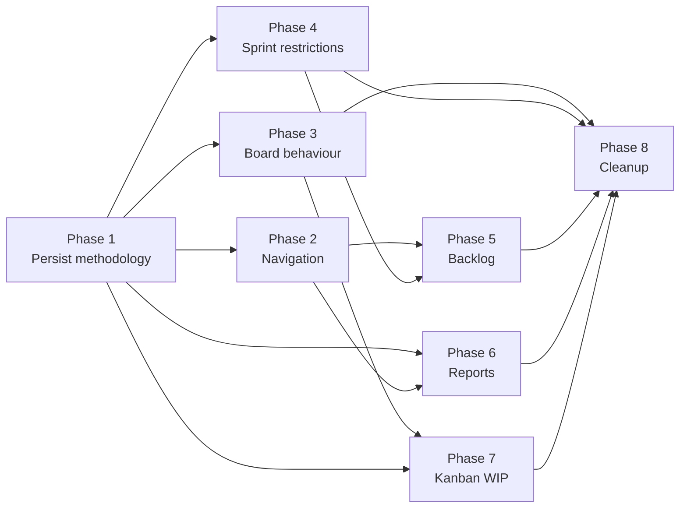

# Scrum vs Kanban Implementation Plan

**Status:** Planning — single source of truth for methodology refactor  
**Goal:** Refactor the application to support Jira-style Scrum and Kanban methodologies  
**Last updated:** 2026-07-04

> This document is documentation only. Implementation must follow the phased plan below. Do not redesign architecture or implement multiple phases in one PR unless explicitly approved.

---

## Table of Contents

1. [Current Architecture](#1-current-architecture)
2. [Jira Behaviour Analysis](#2-jira-behaviour-analysis)
3. [Gap Analysis](#3-gap-analysis)
4. [Architecture Proposal](#4-architecture-proposal)
5. [Implementation Phases](#5-implementation-phases)
6. [Risk Analysis](#6-risk-analysis)
7. [Testing Checklist](#7-testing-checklist)
8. [Cursor Instructions](#8-cursor-instructions)

---

# 1. Current Architecture

## 1.1 Current Project Structure

### Repository layout

```text
project_management/
├── backend/                    # Django REST API
│   ├── apps/
│   │   ├── accounts/           # Auth, users, profiles
│   │   ├── organizations/      # Org membership
│   │   ├── projects/           # Project CRUD, dashboard, reports
│   │   ├── issues/             # Issues, backlog, board/kanban read APIs
│   │   ├── sprints/            # Sprint model, lifecycle, sprint board APIs
│   │   ├── workflow/           # Statuses, transitions, TransitionService
│   │   ├── permissions/        # PermissionService, role checks
│   │   ├── contracts/          # Cross-module DTOs and facades
│   │   ├── label/              # Issue labels
│   │   └── foundation/         # Base models, response envelope
│   ├── config/settings/        # Django settings
│   └── core/urls.py            # Root API routing
│
└── frontend/                   # React + Vite + TypeScript
    └── src/
        ├── app/routes.tsx      # React Router route tree
        ├── constants/routes.ts # Path builders and route matchers
        ├── components/layout/  # AppShell, ProjectShell, Sidebar, ProjectNav
        ├── contexts/           # SprintsContext, IssuesContext
        ├── features/
        │   ├── kanban/         # Primary board (DndKit, filters, hooks)
        │   ├── backlog/        # Backlog data hook, section utils
        │   ├── sprints/        # Sprint CRUD, planning UI, workspace sprints
        │   ├── projects/       # Project pages (backlog, board, sprints)
        │   ├── tasks/          # Legacy board/list views (not primary routes)
        │   └── dashboard/      # Widgets (burndown placeholder, active sprints)
        ├── api/                # HTTP clients per domain
        ├── hooks/              # useSprintActions, useLoadProjectSprints, etc.
        └── types/              # TypeScript domain types
```

### Backend domain models (planning-relevant)

| Model | Location | Key fields |
|-------|----------|------------|
| **Project** | `backend/apps/projects/models/project.py` | `organization`, `key`, `slug`, `name`, `description`, `lead_user`, `status`, `visibility`, `archived_at`, `next_issue_number` — **no `methodology` or `board_type`** |
| **Sprint** | `backend/apps/sprints/models/sprint.py` | `project`, `name`, `goal`, `start_date`, `end_date`, `status` (`planned` \| `active` \| `paused` \| `completed` \| `cancelled`), `capacity_points` |
| **Issue** | `backend/apps/issues/models/issue.py` | `project`, `key`, `title`, `type`, `priority`, `status` (FK WorkflowStatus), `sprint` (nullable — `null` = backlog), `assignee`, `reporter`, `story_points`, `parent_issue` |
| **WorkflowScheme** | `backend/apps/workflow/models/` | One per project; statuses + transitions |

### Layering (locked by `ARCHITECTURE_RULES.md`)

- **Views** → HTTP only (≤15 logic lines)
- **Services** → business logic, writes
- **Selectors** → read-only queries and projections
- **Contracts** → cross-module DTOs (`apps/contracts/`)
- **Board** → read projection only; transitions via `TransitionService` only

There is **no dedicated `apps/board/` module** today. Board logic lives in `apps/issues/selectors.py`.

---

## 1.2 Current Routing

### Frontend routes (`frontend/src/app/routes.tsx`)

**Workspace (inside `AppShell`):**

| Path | Component |
|------|-----------|
| `/` | Dashboard |
| `/tasks` | My Tasks |
| `/sprints` | Workspace Sprints |
| `/projects` | Projects list |
| `/projects/:projectId` | `ProjectShell` (nested) |

**Project workspace (`/projects/:projectId/...`):**

| Path | Component | Notes |
|------|-----------|-------|
| `/projects/:projectId` | `ProjectOverviewPage` | Index |
| `/projects/:projectId/activity` | `ProjectActivityPage` | |
| `/projects/:projectId/backlog` | `ProjectBacklogPage` | Supports `?sprint={sprintId}` |
| `/projects/:projectId/board` | `ProjectKanbanPage` | **All project issues** — not sprint-scoped |
| `/projects/:projectId/sprints` | `ProjectSprintsPage` | Sprint list + lifecycle |
| `/projects/:projectId/sprints/:sprintId` | `SprintDetailPage` | Overview |
| `/projects/:projectId/sprints/:sprintId/planning` | Redirect → backlog `?sprint=` | |
| `/projects/:projectId/sprints/:sprintId/board` | `SprintBoardPage` → `ProjectKanbanPage` | Sprint-scoped |
| `/projects/:projectId/sprints/:sprintId/list` | `SprintListPage` | |
| `/projects/:projectId/sprints/:sprintId/activity` | `SprintActivityPage` | |
| `/projects/:projectId/reports` | `ProjectPlaceholderPage` | **Stub only** |
| `/projects/:projectId/settings/*` | Settings layout | |

**Legacy redirects:** `/board` → first project board; `/board/advanced` → advanced board overlay.

**Navigation sources:**

- Sidebar: `PROJECT_NAV_ITEMS` in `sidebarNav.ts` — Overview, Backlog, Board, Sprints, Members, Settings
- Header tabs: `ProjectNav.tsx` — Overview, Backlog, Board, Sprints, Activity, Releases, Team, Settings (**Reports route exists but is not in nav**)

All projects receive identical navigation regardless of any create-form methodology choice.

### Backend API routes (planning-relevant)

| Area | Base paths |
|------|------------|
| Projects | `/api/projects/{project_id}/` — CRUD, dashboard, reports |
| Issues | `/api/issues/{issue_id}/` — CRUD, transition, assign-sprint |
| Backlog | `/api/projects/{project_id}/backlog`, `.../backlog/issues`, `.../backlog/sprints/{sprint_id}/issues` |
| Board/Kanban | `/api/projects/{project_id}/kanban` (alias `/board`), column + filter endpoints |
| Sprint board | `/api/projects/{project_id}/sprints/{sprint_id}/board` |
| Sprints | `/api/projects/{project_id}/sprints/` — CRUD, start/pause/resume/complete |
| Reports | `/api/projects/{project_id}/reports/summary`, `.../sprint-health`, `.../workload` |
| Workflow | `/api/projects/{project_id}/workflow/` — statuses, transitions |

---

## 1.3 Current Sprint Implementation

### Model and lifecycle

Sprint statuses: `planned` → `active` ↔ `paused` → `completed` (also `cancelled` in enum but no API to reach it).

**Service:** `backend/apps/sprints/services/sprint_service.py`

| Action | Behaviour |
|--------|-----------|
| `create_sprint` | Creates `planned` sprint; requires `can_start_sprint` permission |
| `update_sprint` | Name, goal, dates, capacity only; status cannot be PATCHed |
| `start_sprint` | `planned` → `active`; **does not pause other active sprints** (parallel sprints supported) |
| `pause_sprint` | `active` → `paused` |
| `resume_sprint` | `paused` → `active` |
| `complete_sprint` | Moves incomplete issues (backlog or target planned sprint), then `completed` |

**Not enforced today:** date validation before start, minimum issue count, sprint cancel API.

### Selectors and metrics

- `get_project_sprints()` — ordered active → planned → paused → completed/cancelled
- `get_active_sprints()` — all active (parallel)
- `get_project_kanban_sprint()` — active → paused → latest planned (helper, underused)
- `get_sprint_metrics()` / `select_project_sprint_health()` — issue counts, story points, progress %

### Frontend sprint UI

- `ProjectSprintsPage` — grouped list with start/pause/resume/complete
- `SprintDetailPage` — metrics, goal, progress; burndown placeholder
- `CreateSprintDrawer`, `CompleteSprintModal`
- `useSprintActions` — orchestrates API calls + refreshes sprints, backlog, kanban
- `SprintModuleTabs` component exists but is **not mounted** on sprint pages

---

## 1.4 Current Board Implementation

### Backend

Board is a **read-only projection** in `apps/issues/selectors.py`:

- `get_project_board_metadata()` — `sprint_id=None` → **all top-level project issues** via `get_project_issues()`
- `get_sprint_board_metadata()` — issues where `sprint_id` matches
- `get_board_column_issues()` — paginated per workflow column (default page size 15, max 100)
- Filters: assignee, status, priority, label, search, due date

**Transitions:** `POST /api/issues/{issue_id}/transition` via `TransitionService`. No board move endpoint.

`KANBAN_DIRECT_TRANSITIONS` in `transition_service.py` allows direct `in_progress ↔ done` as a kanban shortcut.

### Frontend

Primary stack in `frontend/src/features/kanban/`:

```text
ProjectKanbanPage
  ├── BoardFilters (URL-synced search params)
  ├── BoardViewSwitcher (?view=board|list)
  ├── KanbanBoardView
  │     └── KanbanDndProvider (@dnd-kit/core)
  │           └── KanbanColumn[] → TaskCard[]
  └── IssueListView (list mode)
```

- **Single page, dual scope:** optional `sprintId` route param switches API between project board and sprint board
- **Drag-drop:** optimistic column move → `transitionIssue` API → rollback on error
- **Refresh bridge:** `kanbanRefreshBridge.ts` coordinates cross-feature refresh after mutations
- **Legacy:** `features/tasks/IssueBoardView.tsx` (HTML5 drag) — not used by main routes
- **Advanced board:** `AdvancedBoardPage` — mock data demo overlay

### Drift from Phase 9 freeze

`.cursor/freeze/phase-9-freeze.md` specifies project board should show **active sprint issues only** and return empty when no active sprint. **Current implementation shows all project issues** (including backlog). Tests in `test_issue_api.py` assert this all-issues behaviour.

---

## 1.5 Current Backlog Implementation

Backlog is **not a separate model** — issues with `sprint_id IS NULL`.

### Backend

| Endpoint | Purpose |
|----------|---------|
| `GET .../backlog` | Metadata: `backlog_issue_count`, sprint list with `issue_count` |
| `GET .../backlog/issues` | Paginated unsprinted top-level issues |
| `GET .../backlog/sprints/{sprint_id}/issues` | Paginated issues in a sprint section (planning) |

Writes: `POST .../issues/{id}/assign-sprint`, `POST .../issues/bulk/assign-sprint`, PATCH issue `sprint` field.

Subtasks excluded from backlog list queries (`parent_issue__isnull=True`). Ordering: `-created_at` (no rank/position field).

### Frontend

`ProjectBacklogPage` — vertical collapsible sections:

1. Backlog section (unsprinted issues)
2. One section per sprint (from metadata)

- Native HTML5 drag-drop for sprint assignment (not dnd-kit)
- `useProjectBacklog` — lazy pagination per section, optimistic moves
- `?sprint={id}` expands/highlights a sprint section
- Planning components shared with sprints: `PlanningSection`, `PlanningBulkBar`, `PlanningSprintMenu`

---

## 1.6 Current Reports

### Backend (`backend/apps/projects/selectors.py`, `api/views.py`)

| Endpoint | Metrics |
|----------|---------|
| `GET /api/dashboard/summary` | Workspace: visible projects, active sprints, open issues, assigned-to-me, overdue |
| `GET .../reports/summary` | Total/open/done/backlog issues, active sprint(s), counts by status/priority/assignee |
| `GET .../reports/sprint-health` | Per-sprint: committed/completed/remaining story points, issue counts, progress % |
| `GET .../reports/workload` | Issue counts by assignee |

**Backlog count in reports** uses broad definition: unsprinted OR not in an active sprint.

### Frontend

- `/projects/:projectId/reports` → `ProjectPlaceholderPage` ("Velocity, burndown, and delivery metrics")
- `getProjectReportSummary` used on overview KPIs only
- `SprintDetailPage` — burndown placeholder
- `SprintBurndownChart` dashboard widget — SVG approximation from sprint stats

**Not implemented:** burndown API, velocity, cumulative flow, control chart, dedicated reports UI.

---

## 1.7 Current Methodology Handling

| Layer | State |
|-------|-------|
| **Frontend create form** | `ProjectMethodology = 'scrum' \| 'kanban'` in `types/createProject.ts`; radio in `CreateProjectDrawer.tsx`; scrum shows default sprint duration (1–4 weeks) |
| **Frontend submit** | **Methodology NOT sent** — only `key`, `slug`, `name`, `description` posted to API |
| **Frontend Project type** | **No `methodology` field** on `types/projects.ts` |
| **Backend Project model** | **No `methodology` or `board_type` field** |
| **Runtime UI** | All projects get Backlog, Board, Sprints nav; no branching |
| **`board_type`** | Does not exist anywhere in codebase |

Practical behaviour today: every project is treated as Scrum-capable regardless of create-form selection.

---

## 1.8 Existing Limitations

1. **Methodology is cosmetic** — collected in UI, never persisted or enforced
2. **No `board_type`** — cannot distinguish scrum board vs kanban board configuration
3. **Project board scope mismatch** — shows all issues; Phase 9 freeze and Jira Scrum expect active-sprint scope
4. **No WIP limits** — not in models, API, or UI
5. **No issue ranking** — `position` field removed; backlog order is `created_at DESC` only
6. **Reports are stubs** — no burndown, velocity, CFD, or control chart
7. **Sprint cancel unreachable** — `cancelled` status exists but no service/API
8. **Dead navigation chrome** — `SprintModuleTabs` defined but unused; Reports route hidden from nav
9. **Dual board implementations** — `features/kanban/` (production) vs `features/tasks/` (legacy)
10. **Contract drift** — `ProjectSummaryDTO.active_sprint_id` never populated; `get_project_board_context()` raises `NotImplementedError`
11. **Kanban methodology still exposes sprint APIs** — no server-side restriction
12. **No swimlanes, no board settings** — out of prior scope
13. **Subtask handling inconsistent** — excluded from board/backlog lists but counted in some sprint metrics
14. **README / memory doc drift** — parallel sprints implemented but older docs describe one-active-sprint rules

---

# 2. Jira Behaviour Analysis

This section describes how **Jira Software** (Cloud) behaves for Scrum and Kanban project templates. Use it as the behavioural target, not a feature-for-feature clone.

## 2.1 Navigation

| Area | Scrum project | Kanban project |
|------|---------------|----------------|
| Primary sidebar | **Backlog**, **Board** (active sprint board), optional **Reports** | **Board** only |
| Sprints | Implicit via Backlog sections and Board sprint selector; dedicated Sprint pages in some views | **Not present** — no sprint concept |
| Releases | Optional module | Optional module |
| Project settings | Under project settings gear | Same |
| Quick create | Issue create available everywhere | Same |
| Workspace | Cross-project boards possible (advanced) | Same |

**Key difference:** Scrum navigation centres on **Backlog + Sprint Board**; Kanban navigation centres on a **single continuous Board**.

## 2.2 Routes

Jira uses project-key-based URLs. Conceptual mapping:

| Jira (Scrum) | Purpose |
|--------------|---------|
| `/projects/{KEY}/boards/{boardId}/backlog` | Backlog + sprint planning |
| `/projects/{KEY}/boards/{boardId}` | Active sprint board (with sprint switcher when parallel sprints enabled) |
| `/projects/{KEY}/reports` | Burndown, velocity, etc. |

| Jira (Kanban) | Purpose |
|---------------|---------|
| `/projects/{KEY}/boards/{boardId}` | Continuous flow board (all eligible issues) |
| `/projects/{KEY}/reports` | Control chart, cumulative flow |

Jira does **not** expose separate `/sprints/:id/board` routes to users in the same way this app does — sprint context is usually selected **within** the board via a sprint dropdown.

## 2.3 Board

| Aspect | Scrum | Kanban |
|--------|-------|--------|
| **Issue scope** | Issues in the **selected active sprint** (or empty state if none) | **All issues** on the board (continuous flow) |
| **Backlog on board** | Never — backlog is separate view | N/A — no backlog view |
| **Columns** | From workflow (To Do, In Progress, Done, custom) | Same |
| **Sprint selector** | Yes — switch between parallel active sprints | No |
| **Empty state** | "No active sprint" or "Start sprint" CTA | Board shows all open work |
| **Drag-drop** | Triggers workflow transition | Same |
| **Quick filters** | Yes | Yes |
| **Swimlanes** | Optional (assignee, epic, etc.) | Optional |
| **WIP limits** | Uncommon on scrum board | **Per-column WIP limits** with visual enforcement |
| **Done column** | Often hides/collapses done issues after period | Configurable |

## 2.4 Backlog

| Aspect | Scrum | Kanban |
|--------|-------|--------|
| **Exists** | Yes — primary planning surface | **No dedicated backlog view** |
| **Structure** | Ordered backlog + sprint panels (planned/active) | Issues enter board directly |
| **Planning** | Drag issues from backlog into sprint | N/A |
| **Ranking** | Manual rank order persisted | Optional column sort only |
| **Estimation** | Story points on backlog items | Optional |
| **Create issue** | Inline create in backlog | Create from board or issue navigator |

## 2.5 Sprint Lifecycle

| Stage | Scrum (Jira) | Kanban (Jira) |
|-------|--------------|---------------|
| Create sprint | From backlog; name, dates, goal | **Not applicable** |
| Plan sprint | Drag issues into sprint panel | N/A |
| Start sprint | Moves sprint to active; board shows its issues | N/A |
| Parallel sprints | Supported (feature-flagged in Jira) | N/A |
| Complete sprint | Move incomplete issues to backlog or next sprint | N/A |
| Pause | Not a standard Jira state (this app has `paused` — keep for power users) | N/A |

## 2.6 Sprint Planning

**Scrum:** Backlog view is the planning surface. Users drag issues between backlog and sprint containers, set sprint goal, dates, and capacity. Starting the sprint locks the commitment for the board view.

**Kanban:** No sprint planning. New work is prioritised via column order, WIP limits, and optional quick filters.

## 2.7 Reports

| Report | Scrum | Kanban |
|--------|-------|--------|
| **Burndown chart** | Primary — sprint burndown | N/A |
| **Velocity chart** | Sprint velocity over time | N/A |
| **Sprint report** | Committed vs completed | N/A |
| **Cumulative flow diagram (CFD)** | Available | **Primary** |
| **Control chart** | Less common | **Primary** (cycle time) |
| **Epic report** | Both | Both |

## 2.8 WIP Limits

| Aspect | Scrum | Kanban |
|--------|-------|--------|
| Per-column limit | Rarely used | **Core feature** |
| Enforcement | N/A | Soft warning or hard block on transition/drag |
| Visualization | N/A | Column header shows `count/limit` |
| Configuration | Board settings | Board settings |

## 2.9 Issue Flow

Both methodologies share the **project workflow** (statuses + transitions).

| Aspect | Scrum | Kanban |
|--------|-------|--------|
| Transitions | Workflow rules enforced | Same |
| Sprint assignment | Required for board visibility (active sprint) | **No sprint field** — issues always on board |
| Release version | Optional | Optional |
| Resolution | Done status category | Same |

## 2.10 Project Settings

| Setting | Scrum | Kanban |
|---------|-------|--------|
| Template at creation | Scrum software | Kanban software |
| Methodology change | Difficult / not recommended in Jira | Same |
| Workflow scheme | Per project | Per project |
| Board type | Scrum board | Kanban board |
| Estimation | Story points common | Optional |
| Default sprint duration | Configurable (Scrum) | N/A |
| Feature toggles | Backlog, sprints, reports | Board, reports (flow metrics) |

---

# 3. Gap Analysis

| # | Current Behaviour | Expected Behaviour (Jira-style) | Priority |
|---|-------------------|----------------------------------|----------|
| G1 | `methodology` collected in create form but not sent to API | Persist `methodology` on Project at creation; default `scrum` for existing rows | **P0** |
| G2 | No `board_type` field | Persist `board_type` (`scrum` \| `kanban`) derived from methodology; extensible for future board layouts | **P0** |
| G3 | All projects show Backlog + Sprints nav | Kanban projects hide Backlog, Sprints, sprint quick actions, and sprint planning routes | **P0** |
| G4 | Project board shows all project issues | Scrum project board shows **active sprint issues only**; empty state when no active sprint | **P0** |
| G5 | Project board same for all projects | Kanban project board shows **all open project issues** (continuous flow) | **P0** |
| G6 | No sprint selector on scrum board | When parallel active sprints exist, board has sprint switcher (default: most recently started) | **P1** |
| G7 | Sprint APIs unrestricted on Kanban projects | Kanban projects return 404 or 403 on sprint create/list/mutate (or hide via UI only — prefer API enforcement) | **P1** |
| G8 | Backlog accessible on Kanban projects | Kanban has no backlog view; issues created directly onto board | **P1** |
| G9 | `assign-sprint` unrestricted | Kanban projects reject sprint assignment on issues (sprint FK remains null) | **P1** |
| G10 | No issue ranking | Scrum backlog supports manual rank order (position field or rank table) | **P2** |
| G11 | Reports page is placeholder | Scrum reports: burndown, velocity, sprint health UI | **P1** |
| G12 | No flow metrics | Kanban reports: cumulative flow, control chart (cycle time) | **P2** |
| G13 | No WIP limits | Kanban board columns show WIP limit; transition blocked or warned when exceeded | **P2** |
| G14 | WIP limits N/A for Scrum | Scrum board does not enforce WIP (matches Jira) | **P3** |
| G15 | `default_sprint_weeks` in UI only | Persist `default_sprint_weeks` on Scrum projects; pre-fill `CreateSprintDrawer` | **P2** |
| G16 | Project type not in API responses | `GET /api/projects/{id}` and list endpoints include `methodology`, `board_type` | **P0** |
| G17 | Frontend `Project` type lacks methodology | TypeScript types and contexts carry methodology for nav gating | **P0** |
| G18 | `CreateProjectDrawer` drops methodology on submit | Submit `methodology` (+ `default_sprint_weeks` when scrum) to create API | **P0** |
| G19 | Sprint planning redirect exists for all projects | Hide `/sprints/:id/planning` redirect and planning entry points for Kanban | **P1** |
| G20 | Workspace `/sprints` page lists all sprints | Filter or label by methodology; Kanban projects contribute no sprints | **P2** |
| G21 | `ProjectNav` identical for all projects | Methodology-aware tabs: Kanban shows Board + Reports; Scrum shows Backlog + Board + Sprints + Reports | **P0** |
| G22 | Reports not in `ProjectNav` | Add Reports tab for both methodologies (when reports phase ships) | **P2** |
| G23 | `SprintModuleTabs` dead code | Wire sprint sub-nav (Board, List, Activity) on scrum sprint pages only | **P2** |
| G24 | Phase 9 freeze conflicts with tests | Align board scope rules with methodology; update tests per phase | **P0** |
| G25 | `get_project_kanban_sprint()` underused | Scrum board selector uses active sprint resolution contract | **P1** |
| G26 | No board empty-state UX for scrum | "No active sprint — start or create one" with links | **P1** |
| G27 | Kanban direct transitions exist globally | Scope `KANBAN_DIRECT_TRANSITIONS` to kanban methodology only (optional tightening) | **P3** |
| G28 | No project settings methodology display | Settings → General shows methodology (read-only initially; change = future) | **P2** |
| G29 | `active_sprint_id` in contract always null | Populate for scrum projects in project summary/context APIs | **P2** |
| G30 | Burndown widget uses approximation | Burndown backed by time-series API for scrum sprints | **P2** |
| G31 | Subtasks excluded from board but in metrics | Document and align subtask policy per methodology | **P3** |
| G32 | Legacy `/board` redirects ignore methodology | Legacy redirects land on correct board for project methodology | **P2** |
| G33 | `AdvancedBoardPage` uses mock data | Hide or gate advanced board behind feature flag | **P3** |
| G34 | Two board implementations (`kanban/` vs `tasks/`) | Consolidate on `features/kanban/`; deprecate legacy | **P3** |
| G35 | No `apps/board/` module | Optional later extraction; keep read-only projection contract | **P3** |
| G36 | Sprint cancel status unreachable | Add cancel sprint API or remove `cancelled` from enum (decision in Phase 4) | **P3** |
| G37 | Permissions same for all methodologies | `can_plan_sprint` irrelevant for Kanban; guard in PermissionService or service layer | **P2** |
| G38 | Quick action "Create Sprint" always visible | Hide for Kanban projects in sidebar | **P1** |
| G39 | Issue create defaults for Kanban | New issues on Kanban skip sprint assignment; appear on board | **P1** |
| G40 | Parallel sprint board routing `/sprints/:id/board` | Keep for deep links; scrum primary board uses project `/board` with sprint selector | **P2** |

---

# 4. Architecture Proposal

## 4.1 Project Model Extensions

Add fields to `Project` (migration in Phase 1):

```python
class ProjectMethodology(models.TextChoices):
    SCRUM = "scrum", "Scrum"
    KANBAN = "kanban", "Kanban"

class BoardType(models.TextChoices):
    SCRUM = "scrum", "Scrum Board"
    KANBAN = "kanban", "Kanban Board"
    # Future: SIMPLE = "simple", "Simple Board"
```

| Field | Type | Default | Notes |
|-------|------|---------|-------|
| `methodology` | `CharField(choices=ProjectMethodology)` | `scrum` | Drives feature availability |
| `board_type` | `CharField(choices=BoardType)` | `scrum` | Decoupled for future board layouts |
| `default_sprint_weeks` | `PositiveSmallIntegerField`, nullable | `2` | Scrum only; null for Kanban |

**Backward compatibility:** Migration sets `methodology=scrum`, `board_type=scrum` for all existing projects.

**Future extensibility:**

- `board_type` can add new values without changing `methodology` (e.g. scrum project with simplified board)
- `methodology` remains the **feature gate** (sprints, backlog, report types)
- Optional JSON `board_config` later for WIP limits, swimlanes, column constraints — **not Phase 1**

**Creation rule:** When `methodology=kanban` → set `board_type=kanban`, `default_sprint_weeks=null`. When `methodology=scrum` → set `board_type=scrum`, apply `default_sprint_weeks`.

## 4.2 Backend Responsibilities

| Concern | Owner | Responsibility |
|---------|-------|----------------|
| Methodology persistence | `apps/projects` | Model, migration, serializers, create/update validation |
| Methodology enforcement | `apps/projects` services + `apps/sprints` services + `apps/issues` services | Reject sprint/backlog operations on Kanban projects |
| Board scope resolution | `apps/issues/selectors.py` (future `apps/board/selectors.py`) | `resolve_board_scope(project)` → filter queryset by methodology |
| Active sprint resolution | `apps/sprints/selectors.py` + `apps/contracts/sprint_contract.py` | `get_board_sprint(project_id, selected_sprint_id?)` for scrum |
| WIP limits (Kanban) | `apps/workflow` or `apps/projects` | Store per-status limits; enforce in `TransitionService` |
| Backlog reads | `apps/issues/selectors.py` | Scrum only; return 404 or empty for Kanban |
| Sprint lifecycle | `apps/sprints/services/` | Unchanged logic; gated by methodology |
| Reports | `apps/projects/selectors.py` | Methodology-specific report endpoints |
| Permissions | `apps/permissions/services.py` | Optional `can_access_sprints(project, user)` helper |
| Contracts | `apps/contracts/project_contract.py` | Expose `methodology`, `board_type`, `default_sprint_weeks`, `active_sprint_id` |

**Board scope algorithm (read path):**

```text
resolve_board_issues(project, sprint_id=None):
  if project.methodology == KANBAN:
    return all top-level project issues (respect filters)

  if project.methodology == SCRUM:
    if sprint_id provided:
      return issues where sprint_id = sprint_id
    active = get_active_sprints(project) or get_project_kanban_sprint(project)
    if no active sprint:
      return empty queryset
    return issues for selected/default active sprint
```

**Transition path unchanged:** `POST /api/issues/{id}/transition` — add WIP check inside `TransitionService` for Kanban only.

## 4.3 Frontend Responsibilities

| Concern | Owner | Responsibility |
|---------|-------|----------------|
| Methodology on Project type | `types/projects.ts`, API mappers | Parse and store from API |
| Methodology-aware nav | `sidebarNav.ts`, `ProjectNav.tsx`, `ProjectShell.tsx` | Conditional nav items and quick actions |
| Board page scope | `ProjectKanbanPage`, `useProjectKanban` | Pass sprint selector param for scrum; all issues for kanban |
| Sprint selector UI | New `SprintBoardSelector` component | Scrum board header when parallel sprints |
| Backlog gating | `ProjectBacklogPage`, routes | Redirect Kanban → board |
| Sprint pages gating | `routes.tsx`, sprint features | Route guards for Kanban |
| Create project | `CreateProjectDrawer.tsx` | Submit methodology fields |
| Reports | `ProjectReportsPage` (new) | Methodology-specific tabs |
| WIP display | `KanbanColumn.tsx` | Show count/limit for Kanban |
| Empty states | `ProjectKanbanPage` | Scrum: no active sprint; Kanban: no issues |

**Central hook:** `useProjectMethodology(projectId)` — returns `{ methodology, boardType, isScrum, isKanban }` from project context.

## 4.4 Shared Components

Reuse without methodology fork:

| Component | Location | Used by |
|-----------|----------|---------|
| `KanbanBoardView` | `features/kanban/` | Scrum + Kanban boards |
| `KanbanDndProvider` | `features/kanban/` | Both |
| `KanbanColumn` | `features/kanban/` | Both (+ WIP badge for Kanban) |
| `TaskCard` | `features/kanban/` | Both |
| `BoardFilters` | `features/kanban/` | Both |
| `BoardViewSwitcher` | `features/kanban/` | Both |
| `IssueListView` | `features/tasks/` | Both (list mode) |
| `IssueDetailDrawer` | issue features | Both |
| `TransitionService` integration | `useProjectKanban` | Both |
| `kanbanRefreshBridge` | `features/kanban/` | Both |

## 4.5 Methodology-Specific Components

| Component | Methodology | Purpose |
|-----------|-------------|---------|
| `ProjectBacklogPage` | Scrum | Backlog + sprint sections |
| `PlanningSection`, `PlanningBulkBar` | Scrum | Sprint planning drag-drop |
| `ProjectSprintsPage`, `SprintDetailPage` | Scrum | Sprint management |
| `CreateSprintDrawer`, `CompleteSprintModal` | Scrum | Sprint lifecycle |
| `SprintBoardSelector` | Scrum | Parallel sprint switcher on board |
| `ScrumReportsPage` | Scrum | Burndown, velocity, sprint health |
| `KanbanReportsPage` | Kanban | CFD, control chart |
| `WipLimitEditor` | Kanban | Board settings (later) |
| `ScrumBoardEmptyState` | Scrum | No active sprint CTA |
| `KanbanBoardEmptyState` | Kanban | No issues CTA |

**Routing guard pattern:**

```tsx
// Pseudocode — implement in Phase 2
if (isKanban && isScrumOnlyRoute) {
  return <Navigate to={projectBoardPath(projectId)} replace />
}
```

---

# 5. Implementation Phases

Each phase is an independent, reviewable unit. Complete and test before starting the next. Do not combine phases without explicit approval.

---

## Phase 1 — Persist Methodology

**Objective:** Store `methodology`, `board_type`, and `default_sprint_weeks` on Project; expose via API; wire create-project form.

**Files likely affected:**

| Layer | Files |
|-------|-------|
| Backend model | `backend/apps/projects/models/project.py` |
| Backend migration | `backend/apps/projects/migrations/` (new) |
| Backend serializers | `backend/apps/projects/api/serializers.py` |
| Backend services | `backend/apps/projects/services/project_service.py` |
| Backend contracts | `backend/apps/contracts/project_contract.py` |
| Backend selectors | `backend/apps/projects/selectors.py` |
| Backend tests | `backend/apps/projects/tests/` |
| Frontend types | `frontend/src/types/projects.ts`, `types/createProject.ts` |
| Frontend API | `frontend/src/api/projects.ts` |
| Frontend create | `frontend/src/features/projects/CreateProjectDrawer.tsx` |
| Frontend mappers | project create/list mappers |

**Dependencies:** None.

**Estimated complexity:** Low–Medium (migration + API + form wiring).

**Expected result:**

- All existing projects default to `methodology=scrum`, `board_type=scrum`
- `POST /api/projects` accepts `methodology` and optional `default_sprint_weeks`
- `GET` project endpoints return new fields
- Create form persists methodology
- **No UI nav or board behaviour changes yet**

---

## Phase 2 — Navigation

**Objective:** Methodology-aware sidebar, header tabs, quick actions, and route guards.

**Files likely affected:**

| Layer | Files |
|-------|-------|
| Frontend nav | `sidebarNav.ts`, `Sidebar.tsx`, `ProjectNav.tsx`, `ProjectShell.tsx` |
| Frontend routes | `app/routes.tsx` |
| Frontend hook | new `useProjectMethodology.ts` |
| Frontend contexts | project context / `useProjects` |
| Frontend quick actions | sidebar quick action handlers |

**Dependencies:** Phase 1.

**Estimated complexity:** Medium.

**Expected result:**

- Kanban projects: Board, Overview, Activity, Team, Settings visible; **Backlog and Sprints hidden**
- Scrum projects: unchanged nav
- Route guards redirect Kanban users away from `/backlog`, `/sprints/*`
- "Create Sprint" quick action hidden for Kanban
- `useProjectMethodology` available app-wide

---

## Phase 3 — Board Behaviour

**Objective:** Align board issue scope with methodology on backend and frontend.

**Files likely affected:**

| Layer | Files |
|-------|-------|
| Backend selectors | `backend/apps/issues/selectors.py` (`get_project_board_metadata`, `_board_base_queryset`) |
| Backend views | `backend/apps/issues/api/views.py` (`ProjectKanbanView`) |
| Backend contracts | `backend/apps/contracts/issue_contract.py` |
| Backend tests | `backend/apps/issues/tests/test_issue_api.py`, `test_backlog_kanban.py` |
| Frontend hook | `useProjectKanban.ts` |
| Frontend page | `ProjectKanbanPage.tsx` |
| Frontend API | `api/issues.ts`, `api/sprints.ts` |

**Dependencies:** Phase 1.

**Estimated complexity:** Medium–High.

**Expected result:**

- **Scrum** `GET /api/projects/{id}/kanban`: issues from default active sprint only; empty when none active; `selected_sprint` populated
- **Kanban** `GET /api/projects/{id}/kanban`: all top-level project issues (current behaviour preserved)
- Sprint-scoped board route unchanged for scrum deep links
- Frontend shows `ScrumBoardEmptyState` when no active sprint
- Tests updated to reflect methodology-aware scope

---

## Phase 4 — Sprint Restrictions

**Objective:** Enforce Scrum-only sprint and sprint-assignment operations at API level.

**Files likely affected:**

| Layer | Files |
|-------|-------|
| Backend sprint service | `backend/apps/sprints/services/sprint_service.py` |
| Backend issue service | `backend/apps/issues/services/issue_service.py` |
| Backend views | `backend/apps/sprints/api/views.py`, `backend/apps/issues/api/views.py` |
| Backend permissions | `backend/apps/permissions/services.py` (optional helper) |
| Backend tests | `backend/apps/sprints/tests/`, `backend/apps/issues/tests/` |
| Frontend | Remove/hide sprint API calls when Kanban (defensive) |

**Dependencies:** Phase 1.

**Estimated complexity:** Medium.

**Expected result:**

- Kanban project: sprint CRUD returns 400/403 with clear error code
- Kanban project: `assign-sprint` and bulk assign rejected
- Scrum project: unchanged sprint behaviour
- Existing Kanban issues keep `sprint_id=null`

---

## Phase 5 — Backlog

**Objective:** Scrum-only backlog; ranking foundation (optional slice 5b).

**Files likely affected:**

| Layer | Files |
|-------|-------|
| Backend selectors | `backend/apps/issues/selectors.py` (backlog queries) |
| Backend views | backlog views in `backend/apps/issues/api/views.py` |
| Backend model | optional `rank` field on Issue (slice 5b) |
| Frontend | `ProjectBacklogPage.tsx`, `useProjectBacklog.ts` |
| Frontend tests | backlog integration tests |

**Dependencies:** Phase 1, Phase 2 (nav), Phase 4 (API guards).

**Estimated complexity:** Medium (High if ranking added).

**Expected result:**

- Backlog API returns 404 or empty for Kanban with documented behaviour
- Scrum backlog unchanged functionally
- **Slice 5b (optional):** `rank` field + reorder API for manual backlog ordering

---

## Phase 6 — Reports

**Objective:** Replace reports placeholder with methodology-specific report pages.

**Files likely affected:**

| Layer | Files |
|-------|-------|
| Backend selectors | `backend/apps/projects/selectors.py` |
| Backend views | `backend/apps/projects/api/views.py`, `urls.py` |
| Backend new endpoints | burndown time-series (scrum), CFD data (kanban) — minimal viable |
| Frontend | new `ProjectReportsPage.tsx`, `ScrumReportsPage`, `KanbanReportsPage` |
| Frontend nav | `ProjectNav.tsx` — add Reports tab |
| Frontend routes | replace `ProjectPlaceholderPage` on reports route |
| Dashboard widgets | align `SprintBurndownChart` with real data |

**Dependencies:** Phase 1, Phase 2.

**Estimated complexity:** High.

**Expected result:**

- Scrum: sprint health (existing API) + burndown chart UI + velocity placeholder or MVP
- Kanban: summary stats + CFD MVP
- Reports tab visible in project nav
- `/projects/:id/reports` renders real content

---

## Phase 7 — Kanban Metrics (WIP Limits)

**Objective:** Per-column WIP limits for Kanban boards; enforce on transition.

**Files likely affected:**

| Layer | Files |
|-------|-------|
| Backend model | WIP limit storage (WorkflowStatus extension or `board_config` JSON on Project) |
| Backend transition | `backend/apps/workflow/services/transition_service.py` |
| Backend board selectors | column metadata includes `wip_limit`, `wip_count` |
| Frontend | `KanbanColumn.tsx` (WIP badge), board settings UI |
| Frontend transition UX | surface WIP exceeded error from API |

**Dependencies:** Phase 1, Phase 3.

**Estimated complexity:** Medium–High.

**Expected result:**

- Kanban columns display `count/limit`
- Transition blocked when column at WIP limit (configurable hard block first)
- Scrum boards unaffected (no WIP UI)

---

## Phase 8 — Cleanup

**Objective:** Remove drift, dead code, and documentation inconsistencies.

**Files likely affected:**

| Layer | Files |
|-------|-------|
| Frontend | Remove or archive `features/tasks/IssueBoardView` usage; wire `SprintModuleTabs` or delete |
| Frontend | Gate/remove `AdvancedBoardPage` mock |
| Backend contracts | Fix `active_sprint_id` population; implement or remove `get_project_board_context()` |
| Backend | Decide on `cancelled` sprint status — API or enum cleanup |
| Docs | Update `backend/README.md`, phase freezes, memory docs |
| Tests | Architecture tests for board read-only; methodology compliance tests |

**Dependencies:** Phases 1–7.

**Estimated complexity:** Low–Medium.

**Expected result:**

- Single board implementation path
- Contracts match implementation
- Docs reflect parallel sprints and methodology rules
- No dead sprint navigation components

---

### Phase Dependency Graph



---

# 6. Risk Analysis

| Risk | Description | Mitigation |
|------|-------------|------------|
| **Routing regressions** | Route guards may break deep links, bookmarks, and project-switch path preservation | Add integration tests for Kanban redirects; preserve path suffix rules in `SidebarContextPanel` |
| **Permissions** | Sprint permission checks may fire before methodology guard | Check methodology first in service layer; return consistent 403/404 codes |
| **Drag & drop** | Board scope change may leave optimistic cards in wrong column after refresh | Keep optimistic path; force `refreshKanbanBoard()` after scope switch; test scrum empty → active transition |
| **Board refresh** | `kanbanRefreshBridge` may not fire on methodology-sensitive paths | Register refresh listeners per project; add sprint selector change to refresh triggers |
| **Filters** | Filters applied to empty scrum board may confuse users | Reset or preserve filters explicitly when sprint context changes; document behaviour |
| **Reports** | Broad backlog definition in reports may disagree with new scrum board scope | Align `reports/summary` `backlog_issues` definition with methodology in Phase 6 |
| **Parallel sprints** | Sprint selector default may not match user expectation | Default to most recently started active sprint; persist selection in URL `?sprint=` |
| **Existing API clients** | Scrum board scope change breaks consumers expecting all issues on project board | Phase 3 release notes; `selected_sprint` field already in API response — document breaking change |
| **Migration** | Existing projects all become scrum — correct but hides Kanban testing on old data | Seed Kanban test project in fixtures; manual QA project for Kanban |
| **Issue sprint FK on Kanban** | Legacy data with sprint_id on Kanban project | Migration script or data cleanup: null out sprint_id for Kanban projects |
| **WIP enforcement** | Blocks legitimate transitions; frustrates users | Start with soft warning mode feature flag; hard block opt-in per project |
| **Subtask visibility** | Board excludes subtasks; users may expect them | Document policy; add to FAQ in settings |
| **Create project regression** | New required fields reject old API clients | Default `methodology=scrum` in serializer when omitted |
| **Workspace sprints page** | Shows sprints from scrum projects only — may look empty | Filter to scrum projects; show explanatory empty state |
| **Test drift** | `test_issue_api.py` asserts all-issues board | Update in Phase 3 only; split scrum vs kanban test cases |
| **Phase 9 freeze conflict** | Freeze says active-sprint-only for all boards | Update freeze after Phase 3 to methodology-aware rules |

---

# 7. Testing Checklist

## Phase 1 — Persist Methodology

- [ ] Migration applies cleanly on empty and populated databases
- [ ] Existing projects have `methodology=scrum`, `board_type=scrum` after migration
- [ ] `POST /api/projects` with `methodology=kanban` creates project with `board_type=kanban`, `default_sprint_weeks=null`
- [ ] `POST /api/projects` with `methodology=scrum` and `default_sprint_weeks=3` persists value
- [ ] `POST /api/projects` without methodology defaults to scrum
- [ ] `GET /api/projects/{id}` returns new fields
- [ ] Create project UI sends methodology to API
- [ ] Project list and detail pages receive methodology in frontend state

## Phase 2 — Navigation

- [ ] Scrum project shows Backlog, Board, Sprints in sidebar and header
- [ ] Kanban project hides Backlog and Sprints in sidebar and header
- [ ] Direct URL to `/backlog` on Kanban project redirects to board
- [ ] Direct URL to `/sprints` on Kanban project redirects to board
- [ ] "Create Sprint" quick action hidden for Kanban
- [ ] Project switch preserves correct nav for target project methodology
- [ ] Overview and Settings accessible for both methodologies

## Phase 3 — Board Behaviour

- [ ] Scrum project board with no active sprint returns empty columns and correct empty state UI
- [ ] Scrum project board with one active sprint shows only that sprint's issues
- [ ] Scrum project with two active sprints: selector switches issue set
- [ ] Kanban project board shows all top-level issues including unsprinted
- [ ] Sprint-scoped route `/sprints/:id/board` still works for scrum
- [ ] Board filters work for both methodologies
- [ ] Drag-drop transition works on both methodologies
- [ ] Column pagination works after scope change
- [ ] API tests cover scrum and kanban board scope separately

## Phase 4 — Sprint Restrictions

- [ ] Cannot create sprint on Kanban project (API returns error)
- [ ] Cannot start/pause/resume/complete sprint on Kanban project
- [ ] Cannot assign sprint on Kanban issue (single and bulk)
- [ ] Scrum sprint lifecycle unchanged
- [ ] Error messages are clear and actionable

## Phase 5 — Backlog

- [ ] Scrum backlog lists unsprinted issues and sprint sections
- [ ] Kanban backlog API returns appropriate error or empty (per spec)
- [ ] Drag issue from backlog to sprint works (scrum)
- [ ] Bulk assign sprint works (scrum)
- [ ] `?sprint=` query expands correct section (scrum)
- [ ] (If ranking) Reorder backlog persists order across refresh

## Phase 6 — Reports

- [ ] Reports tab visible in project nav
- [ ] Scrum project shows sprint health, burndown, velocity sections
- [ ] Kanban project shows CFD / control chart or documented MVP
- [ ] Reports respect project permissions (viewer can read)
- [ ] Overview KPIs still load without regression
- [ ] Empty states when insufficient data

## Phase 7 — Kanban WIP Limits

- [ ] WIP limit configurable per column (Kanban only)
- [ ] Column header shows count/limit
- [ ] Transition into at-limit column blocked with clear error
- [ ] Transition out of column still allowed
- [ ] Scrum board has no WIP enforcement
- [ ] WIP counts respect board filters (document whether gross or filtered)

## Phase 8 — Cleanup

- [ ] No imports of legacy `IssueBoardView` from production routes
- [ ] `SprintModuleTabs` wired or removed
- [ ] `active_sprint_id` populated in project context for scrum
- [ ] README endpoint table matches implementation
- [ ] Architecture tests pass
- [ ] Full regression: create scrum project, create kanban project, exercise each workflow end-to-end

### Cross-Phase Regression Suite

- [ ] Login → create scrum project → create sprint → assign issues → start sprint → board shows issues → complete sprint
- [ ] Login → create kanban project → create issues → board shows all → transition across columns
- [ ] Parallel scrum sprints: two active, switch selector, complete one
- [ ] Permission denied paths: viewer cannot start sprint (scrum)
- [ ] Project archive disables planning actions for both methodologies

---

# 8. Cursor Instructions

When implementing any phase of the Scrum/Kanban refactor, future Cursor prompts **must** follow these rules:

1. **Always follow this document.** `plans/scrum-vs-kanban-plan.md` is the single source of truth. If behaviour is unclear, update this document before implementing.

2. **Do not redesign architecture.** Use the layering defined in `.cursor/plans/ARCHITECTURE_RULES.md`: Service → Selector → API; contracts for cross-module access; `TransitionService` as the only transition authority; board as read-only projection.

3. **Modify only files required for the current phase.** Do not pull in scope from later phases. Do not refactor unrelated modules.

4. **Do not refactor unrelated code.** Unrelated cleanups belong in Phase 8 only.

5. **Keep changes incremental.** One phase per PR unless explicitly approved. Complete tests for the phase before moving on.

6. **Preserve backward compatibility.** Existing projects must remain `methodology=scrum` after migration. API fields added in Phase 1 must have sensible defaults when omitted.

7. **Keep Scrum as the default for existing projects.** Migration defaults, serializer defaults, and create-form defaults must all be `scrum`.

8. **Do not implement Kanban and Scrum UI forks for shared components** unless listed in §4.5. Prefer props and hooks (`useProjectMethodology`) over duplicated pages.

9. **Do not add a `POST /board/move` endpoint.** Drag-drop continues to use `POST /api/issues/{id}/transition`.

10. **Update tests in the same phase as behaviour changes** — especially `test_issue_api.py` when board scope changes in Phase 3.

11. **Do not create migrations in documentation-only tasks.** Migrations belong to Phase 1 implementation PRs only.

12. **When completing a phase**, check off the corresponding §7 testing checklist and note any deliberate deviations in this document's changelog section below.

---

## Changelog

| Date | Change |
|------|--------|
| 2026-07-04 | Initial plan created from codebase analysis |
