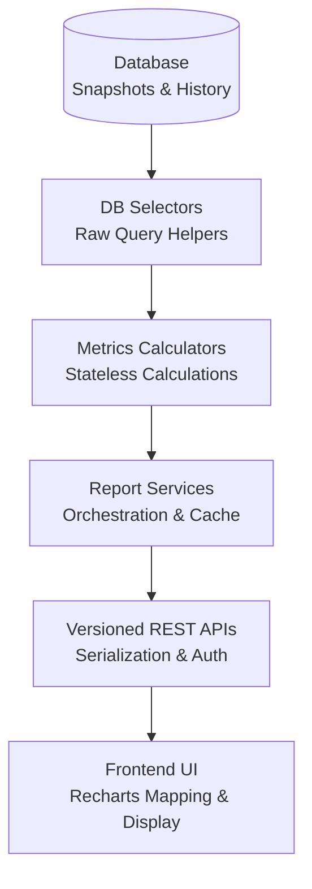
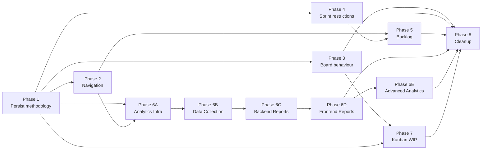

# Scrum vs Kanban Implementation Plan

**Status:** Planning — single source of truth for methodology refactor  
**Goal:** Refactor the application to support Jira-style Scrum and Kanban methodologies  
**Last updated:** 2026-07-04

> This document is documentation only. Implementation must follow the phased plan below. Do not redesign architecture or implement multiple phases in one PR unless explicitly approved.

---

## Table of Contents

1. [Current Architecture](#1-current-architecture)
2. [Jira Behaviour Analysis](#2-jira-behaviour-analysis)
3. [Gap Analysis](#3-gap-analysis)
4. [Architecture Proposal](#4-architecture-proposal)
5. [Implementation Phases](#5-implementation-phases)
   - [Implementation Order](#implementation-order)
   - [Migration Strategy](#migration-strategy)
   - [Feature Matrix](#feature-matrix)
6. [Risk Analysis](#6-risk-analysis)
7. [Testing Checklist](#7-testing-checklist)
8. [Cursor Instructions](#8-cursor-instructions)

---

# 1. Current Architecture

## 1.1 Current Project Structure

### Repository layout

```text
project_management/
├── backend/                    # Django REST API
│   ├── apps/
│   │   ├── accounts/           # Auth, users, profiles
│   │   ├── organizations/      # Org membership
│   │   ├── projects/           # Project CRUD, dashboard, reports
│   │   ├── issues/             # Issues, backlog, board/kanban read APIs
│   │   ├── sprints/            # Sprint model, lifecycle, sprint board APIs
│   │   ├── workflow/           # Statuses, transitions, TransitionService
│   │   ├── permissions/        # PermissionService, role checks
│   │   ├── contracts/          # Cross-module DTOs and facades
│   │   ├── label/              # Issue labels
│   │   └── foundation/         # Base models, response envelope
│   ├── config/settings/        # Django settings
│   └── core/urls.py            # Root API routing
│
└── frontend/                   # React + Vite + TypeScript
    └── src/
        ├── app/routes.tsx      # React Router route tree
        ├── constants/routes.ts # Path builders and route matchers
        ├── components/layout/  # AppShell, ProjectShell, Sidebar, ProjectNav
        ├── contexts/           # SprintsContext, IssuesContext
        ├── features/
        │   ├── kanban/         # Primary board (DndKit, filters, hooks)
        │   ├── backlog/        # Backlog data hook, section utils
        │   ├── sprints/        # Sprint CRUD, planning UI, workspace sprints
        │   ├── projects/       # Project pages (backlog, board, sprints)
        │   ├── tasks/          # Legacy board/list views (not primary routes)
        │   └── dashboard/      # Widgets (burndown placeholder, active sprints)
        ├── api/                # HTTP clients per domain
        ├── hooks/              # useSprintActions, useLoadProjectSprints, etc.
        └── types/              # TypeScript domain types
```

### Backend domain models (planning-relevant)

| Model | Location | Key fields |
|-------|----------|------------|
| **Project** | `backend/apps/projects/models/project.py` | `organization`, `key`, `slug`, `name`, `description`, `lead_user`, `status`, `visibility`, `archived_at`, `next_issue_number` — **no `methodology` or `board_type`** |
| **Sprint** | `backend/apps/sprints/models/sprint.py` | `project`, `name`, `goal`, `start_date`, `end_date`, `status` (`planned` \| `active` \| `paused` \| `completed` \| `cancelled`), `capacity_points` |
| **Issue** | `backend/apps/issues/models/issue.py` | `project`, `key`, `title`, `type`, `priority`, `status` (FK WorkflowStatus), `sprint` (nullable — `null` = backlog), `assignee`, `reporter`, `story_points`, `parent_issue` |
| **WorkflowScheme** | `backend/apps/workflow/models/` | One per project; statuses + transitions |

### Layering (locked by `ARCHITECTURE_RULES.md`)

- **Views** → HTTP only (≤15 logic lines)
- **Services** → business logic, writes
- **Selectors** → read-only queries and projections
- **Contracts** → cross-module DTOs (`apps/contracts/`)
- **Board** → read projection only; transitions via `TransitionService` only

There is **no dedicated `apps/board/` module** today. Board logic lives in `apps/issues/selectors.py`.

---

## 1.2 Current Routing

### Frontend routes (`frontend/src/app/routes.tsx`)

**Workspace (inside `AppShell`):**

| Path | Component |
|------|-----------|
| `/` | Dashboard |
| `/tasks` | My Tasks |
| `/sprints` | Workspace Sprints |
| `/projects` | Projects list |
| `/projects/:projectId` | `ProjectShell` (nested) |

**Project workspace (`/projects/:projectId/...`):**

| Path | Component | Notes |
|------|-----------|-------|
| `/projects/:projectId` | `ProjectOverviewPage` | Index |
| `/projects/:projectId/activity` | `ProjectActivityPage` | |
| `/projects/:projectId/backlog` | `ProjectBacklogPage` | Supports `?sprint={sprintId}` |
| `/projects/:projectId/board` | `ProjectKanbanPage` | **All project issues** — not sprint-scoped |
| `/projects/:projectId/sprints` | `ProjectSprintsPage` | Sprint list + lifecycle |
| `/projects/:projectId/sprints/:sprintId` | `SprintDetailPage` | Overview |
| `/projects/:projectId/sprints/:sprintId/planning` | Redirect → backlog `?sprint=` | |
| `/projects/:projectId/sprints/:sprintId/board` | `SprintBoardPage` → `ProjectKanbanPage` | Sprint-scoped |
| `/projects/:projectId/sprints/:sprintId/list` | `SprintListPage` | |
| `/projects/:projectId/sprints/:sprintId/activity` | `SprintActivityPage` | |
| `/projects/:projectId/reports` | `ProjectPlaceholderPage` | **Stub only** |
| `/projects/:projectId/settings/*` | Settings layout | |

**Legacy redirects:** `/board` → first project board; `/board/advanced` → advanced board overlay.

**Navigation sources:**

- Sidebar: `PROJECT_NAV_ITEMS` in `sidebarNav.ts` — Overview, Backlog, Board, Sprints, Members, Settings
- Header tabs: `ProjectNav.tsx` — Overview, Backlog, Board, Sprints, Activity, Releases, Team, Settings (**Reports route exists but is not in nav**)

All projects receive identical navigation regardless of any create-form methodology choice.

### Backend API routes (planning-relevant)

| Area | Base paths |
|------|------------|
| Projects | `/api/projects/{project_id}/` — CRUD, dashboard, reports |
| Issues | `/api/issues/{issue_id}/` — CRUD, transition, assign-sprint |
| Backlog | `/api/projects/{project_id}/backlog`, `.../backlog/issues`, `.../backlog/sprints/{sprint_id}/issues` |
| Board/Kanban | `/api/projects/{project_id}/kanban` (alias `/board`), column + filter endpoints |
| Sprint board | `/api/projects/{project_id}/sprints/{sprint_id}/board` |
| Sprints | `/api/projects/{project_id}/sprints/` — CRUD, start/pause/resume/complete |
| Reports | `/api/projects/{project_id}/reports/summary`, `.../sprint-health`, `.../workload` |
| Workflow | `/api/projects/{project_id}/workflow/` — statuses, transitions |

---

## 1.3 Current Sprint Implementation

### Model and lifecycle

Sprint statuses: `planned` → `active` ↔ `paused` → `completed` (also `cancelled` in enum but no API to reach it).

**Service:** `backend/apps/sprints/services/sprint_service.py`

| Action | Behaviour |
|--------|-----------|
| `create_sprint` | Creates `planned` sprint; requires `can_start_sprint` permission |
| `update_sprint` | Name, goal, dates, capacity only; status cannot be PATCHed |
| `start_sprint` | `planned` → `active`; **does not pause other active sprints** (parallel sprints supported) |
| `pause_sprint` | `active` → `paused` |
| `resume_sprint` | `paused` → `active` |
| `complete_sprint` | Moves incomplete issues (backlog or target planned sprint), then `completed` |

**Not enforced today:** date validation before start, minimum issue count, sprint cancel API.

### Selectors and metrics

- `get_project_sprints()` — ordered active → planned → paused → completed/cancelled
- `get_active_sprints()` — all active (parallel)
- `get_project_kanban_sprint()` — active → paused → latest planned (helper, underused)
- `get_sprint_metrics()` / `select_project_sprint_health()` — issue counts, story points, progress %

### Frontend sprint UI

- `ProjectSprintsPage` — grouped list with start/pause/resume/complete
- `SprintDetailPage` — metrics, goal, progress; burndown placeholder
- `CreateSprintDrawer`, `CompleteSprintModal`
- `useSprintActions` — orchestrates API calls + refreshes sprints, backlog, kanban
- `SprintModuleTabs` component exists but is **not mounted** on sprint pages

---

## 1.4 Current Board Implementation

### Backend

Board is a **read-only projection** in `apps/issues/selectors.py`:

- `get_project_board_metadata()` — `sprint_id=None` → **all top-level project issues** via `get_project_issues()`
- `get_sprint_board_metadata()` — issues where `sprint_id` matches
- `get_board_column_issues()` — paginated per workflow column (default page size 15, max 100)
- Filters: assignee, status, priority, label, search, due date

**Transitions:** `POST /api/issues/{issue_id}/transition` via `TransitionService`. No board move endpoint.

`KANBAN_DIRECT_TRANSITIONS` in `transition_service.py` allows direct `in_progress ↔ done` as a kanban shortcut.

### Frontend

Primary stack in `frontend/src/features/kanban/`:

```text
ProjectKanbanPage
  ├── BoardFilters (URL-synced search params)
  ├── BoardViewSwitcher (?view=board|list)
  ├── KanbanBoardView
  │     └── KanbanDndProvider (@dnd-kit/core)
  │           └── KanbanColumn[] → TaskCard[]
  └── IssueListView (list mode)
```

- **Single page, dual scope:** optional `sprintId` route param switches API between project board and sprint board
- **Drag-drop:** optimistic column move → `transitionIssue` API → rollback on error
- **Refresh bridge:** `kanbanRefreshBridge.ts` coordinates cross-feature refresh after mutations
- **Legacy:** `features/tasks/IssueBoardView.tsx` (HTML5 drag) — not used by main routes
- **Advanced board:** `AdvancedBoardPage` — mock data demo overlay

### Drift from Phase 9 freeze

`.cursor/freeze/phase-9-freeze.md` specifies project board should show **active sprint issues only** and return empty when no active sprint. **Current implementation shows all project issues** (including backlog). Tests in `test_issue_api.py` assert this all-issues behaviour.

---

## 1.5 Current Backlog Implementation

Backlog is **not a separate model** — issues with `sprint_id IS NULL`.

### Backend

| Endpoint | Purpose |
|----------|---------|
| `GET .../backlog` | Metadata: `backlog_issue_count`, sprint list with `issue_count` |
| `GET .../backlog/issues` | Paginated unsprinted top-level issues |
| `GET .../backlog/sprints/{sprint_id}/issues` | Paginated issues in a sprint section (planning) |

Writes: `POST .../issues/{id}/assign-sprint`, `POST .../issues/bulk/assign-sprint`, PATCH issue `sprint` field.

Subtasks excluded from backlog list queries (`parent_issue__isnull=True`). Ordering: `-created_at` (no rank/position field).

### Frontend

`ProjectBacklogPage` — vertical collapsible sections:

1. Backlog section (unsprinted issues)
2. One section per sprint (from metadata)

- Native HTML5 drag-drop for sprint assignment (not dnd-kit)
- `useProjectBacklog` — lazy pagination per section, optimistic moves
- `?sprint={id}` expands/highlights a sprint section
- Planning components shared with sprints: `PlanningSection`, `PlanningBulkBar`, `PlanningSprintMenu`

---

## 1.6 Current Reports

### Backend (`backend/apps/projects/selectors.py`, `api/views.py`)

| Endpoint | Metrics |
|----------|---------|
| `GET /api/dashboard/summary` | Workspace: visible projects, active sprints, open issues, assigned-to-me, overdue |
| `GET .../reports/summary` | Total/open/done/backlog issues, active sprint(s), counts by status/priority/assignee |
| `GET .../reports/sprint-health` | Per-sprint: committed/completed/remaining story points, issue counts, progress % |
| `GET .../reports/workload` | Issue counts by assignee |

**Backlog count in reports** uses broad definition: unsprinted OR not in an active sprint.

### Frontend

- `/projects/:projectId/reports` → `ProjectPlaceholderPage` ("Velocity, burndown, and delivery metrics")
- `getProjectReportSummary` used on overview KPIs only
- `SprintDetailPage` — burndown placeholder
- `SprintBurndownChart` dashboard widget — SVG approximation from sprint stats

**Not implemented:** burndown API, velocity, cumulative flow, control chart, dedicated reports UI.

---

## 1.7 Current Methodology Handling

| Layer | State |
|-------|-------|
| **Frontend create form** | `ProjectMethodology = 'scrum' \| 'kanban'` in `types/createProject.ts`; radio in `CreateProjectDrawer.tsx`; scrum shows default sprint duration (1–4 weeks) |
| **Frontend submit** | **Methodology NOT sent** — only `key`, `slug`, `name`, `description` posted to API |
| **Frontend Project type** | **No `methodology` field** on `types/projects.ts` |
| **Backend Project model** | **No `methodology` or `board_type` field** |
| **Runtime UI** | All projects get Backlog, Board, Sprints nav; no branching |
| **`board_type`** | Does not exist anywhere in codebase |

Practical behaviour today: every project is treated as Scrum-capable regardless of create-form selection.

---

## 1.8 Existing Limitations

1. **Methodology is cosmetic** — collected in UI, never persisted or enforced
2. **No `board_type`** — cannot distinguish scrum board vs kanban board configuration
3. **Project board scope mismatch** — shows all issues; Phase 9 freeze and Jira Scrum expect active-sprint scope
4. **No WIP limits** — not in models, API, or UI
5. **No issue ranking** — `position` field removed; backlog order is `created_at DESC` only
6. **Reports are stubs** — no burndown, velocity, CFD, or control chart
7. **Sprint cancel unreachable** — `cancelled` status exists but no service/API
8. **Dead navigation chrome** — `SprintModuleTabs` defined but unused; Reports route hidden from nav
9. **Dual board implementations** — `features/kanban/` (production) vs `features/tasks/` (legacy)
10. **Contract drift** — `ProjectSummaryDTO.active_sprint_id` never populated; `get_project_board_context()` raises `NotImplementedError`
11. **Kanban methodology still exposes sprint APIs** — no server-side restriction
12. **No swimlanes, no board settings** — out of prior scope
13. **Subtask handling inconsistent** — excluded from board/backlog lists but counted in some sprint metrics
14. **README / memory doc drift** — parallel sprints implemented but older docs describe one-active-sprint rules

---

# 2. Jira Behaviour Analysis

This section describes how **Jira Software** (Cloud) behaves for Scrum and Kanban project templates. Use it as the behavioural target, not a feature-for-feature clone.

## 2.1 Navigation

| Area | Scrum project | Kanban project |
|------|---------------|----------------|
| Primary sidebar | **Backlog**, **Board** (active sprint board), optional **Reports** | **Board** only |
| Sprints | Implicit via Backlog sections and Board sprint selector; dedicated Sprint pages in some views | **Not present** — no sprint concept |
| Releases | Optional module | Optional module |
| Project settings | Under project settings gear | Same |
| Quick create | Issue create available everywhere | Same |
| Workspace | Cross-project boards possible (advanced) | Same |

**Key difference:** Scrum navigation centres on **Backlog + Sprint Board**; Kanban navigation centres on a **single continuous Board**.

## 2.2 Routes

Jira uses project-key-based URLs. Conceptual mapping:

| Jira (Scrum) | Purpose |
|--------------|---------|
| `/projects/{KEY}/boards/{boardId}/backlog` | Backlog + sprint planning |
| `/projects/{KEY}/boards/{boardId}` | Active sprint board (with sprint switcher when parallel sprints enabled) |
| `/projects/{KEY}/reports` | Burndown, velocity, etc. |

| Jira (Kanban) | Purpose |
|---------------|---------|
| `/projects/{KEY}/boards/{boardId}` | Continuous flow board (all eligible issues) |
| `/projects/{KEY}/reports` | Control chart, cumulative flow |

Jira does **not** expose separate `/sprints/:id/board` routes to users in the same way this app does — sprint context is usually selected **within** the board via a sprint dropdown.

## 2.3 Board

| Aspect | Scrum | Kanban |
|--------|-------|--------|
| **Issue scope** | Issues in the **selected active sprint** (or empty state if none) | **All issues** on the board (continuous flow) |
| **Backlog on board** | Never — backlog is separate view | N/A — no backlog view |
| **Columns** | From workflow (To Do, In Progress, Done, custom) | Same |
| **Sprint selector** | Yes — switch between parallel active sprints | No |
| **Empty state** | "No active sprint" or "Start sprint" CTA | Board shows all open work |
| **Drag-drop** | Triggers workflow transition | Same |
| **Quick filters** | Yes | Yes |
| **Swimlanes** | Optional (assignee, epic, etc.) | Optional |
| **WIP limits** | Uncommon on scrum board | **Per-column WIP limits** with visual enforcement |
| **Done column** | Often hides/collapses done issues after period | Configurable |

## 2.4 Backlog

| Aspect | Scrum | Kanban |
|--------|-------|--------|
| **Exists** | Yes — primary planning surface | **No dedicated backlog view** |
| **Structure** | Ordered backlog + sprint panels (planned/active) | Issues enter board directly |
| **Planning** | Drag issues from backlog into sprint | N/A |
| **Ranking** | Manual rank order persisted | Optional column sort only |
| **Estimation** | Story points on backlog items | Optional |
| **Create issue** | Inline create in backlog | Create from board or issue navigator |

## 2.5 Sprint Lifecycle

| Stage | Scrum (Jira) | Kanban (Jira) |
|-------|--------------|---------------|
| Create sprint | From backlog; name, dates, goal | **Not applicable** |
| Plan sprint | Drag issues into sprint panel | N/A |
| Start sprint | Moves sprint to active; board shows its issues | N/A |
| Parallel sprints | Supported (feature-flagged in Jira) | N/A |
| Complete sprint | Move incomplete issues to backlog or next sprint | N/A |
| Pause | Not a standard Jira state (this app has `paused` — keep for power users) | N/A |

## 2.6 Sprint Planning

**Scrum:** Backlog view is the planning surface. Users drag issues between backlog and sprint containers, set sprint goal, dates, and capacity. Starting the sprint locks the commitment for the board view.

**Kanban:** No sprint planning. New work is prioritised via column order, WIP limits, and optional quick filters.

## 2.7 Reports

| Report | Scrum | Kanban |
|--------|-------|--------|
| **Burndown chart** | Primary — sprint burndown | N/A |
| **Velocity chart** | Sprint velocity over time | N/A |
| **Sprint report** | Committed vs completed | N/A |
| **Cumulative flow diagram (CFD)** | Available | **Primary** |
| **Control chart** | Less common | **Primary** (cycle time) |
| **Epic report** | Both | Both |

## 2.8 WIP Limits

| Aspect | Scrum | Kanban |
|--------|-------|--------|
| Per-column limit | Rarely used | **Core feature** |
| Enforcement | N/A | Soft warning or hard block on transition/drag |
| Visualization | N/A | Column header shows `count/limit` |
| Configuration | Board settings | Board settings |

## 2.9 Issue Flow

Both methodologies share the **project workflow** (statuses + transitions).

| Aspect | Scrum | Kanban |
|--------|-------|--------|
| Transitions | Workflow rules enforced | Same |
| Sprint assignment | Required for board visibility (active sprint) | **No sprint field** — issues always on board |
| Release version | Optional | Optional |
| Resolution | Done status category | Same |

## 2.10 Project Settings

| Setting | Scrum | Kanban |
|---------|-------|--------|
| Template at creation | Scrum software | Kanban software |
| Methodology change | Difficult / not recommended in Jira | Same |
| Workflow scheme | Per project | Per project |
| Board type | Scrum board | Kanban board |
| Estimation | Story points common | Optional |
| Default sprint duration | Configurable (Scrum) | N/A |
| Feature toggles | Backlog, sprints, reports | Board, reports (flow metrics) |

---

# 3. Gap Analysis

| # | Current Behaviour | Expected Behaviour (Jira-style) | Priority |
|---|-------------------|----------------------------------|----------|
| G1 | `methodology` collected in create form but not sent to API | Persist `methodology` on Project at creation; default `scrum` for existing rows | **P0** |
| G2 | No `board_type` field | Persist `board_type` (`scrum` \| `kanban`) derived from methodology; extensible for future board layouts | **P0** |
| G3 | All projects show Backlog + Sprints nav | Kanban projects hide Backlog, Sprints, sprint quick actions, and sprint planning routes | **P0** |
| G4 | Project board shows all project issues | Scrum project board shows **active sprint issues only**; empty state when no active sprint | **P0** |
| G5 | Project board same for all projects | Kanban project board shows **all open project issues** (continuous flow) | **P0** |
| G6 | No sprint selector on scrum board | When parallel active sprints exist, board has sprint switcher (default: most recently started) | **P1** |
| G7 | Sprint APIs unrestricted on Kanban projects | Kanban projects return 404 or 403 on sprint create/list/mutate (or hide via UI only — prefer API enforcement) | **P1** |
| G8 | Backlog accessible on Kanban projects | Kanban has no backlog view; issues created directly onto board | **P1** |
| G9 | `assign-sprint` unrestricted | Kanban projects reject sprint assignment on issues (sprint FK remains null) | **P1** |
| G10 | No issue ranking | Scrum backlog supports manual rank order (position field or rank table) | **P2** |
| G11 | Reports page is placeholder | Scrum reports: burndown, velocity, sprint health UI | **P1** |
| G12 | No flow metrics | Kanban reports: cumulative flow, control chart (cycle time) | **P2** |
| G13 | No WIP limits | Kanban board columns show WIP limit; transition blocked or warned when exceeded | **P2** |
| G14 | WIP limits N/A for Scrum | Scrum board does not enforce WIP (matches Jira) | **P3** |
| G15 | `default_sprint_weeks` in UI only | Persist `default_sprint_weeks` on Scrum projects; pre-fill `CreateSprintDrawer` | **P2** |
| G16 | Project type not in API responses | `GET /api/projects/{id}` and list endpoints include `methodology`, `board_type` | **P0** |
| G17 | Frontend `Project` type lacks methodology | TypeScript types and contexts carry methodology for nav gating | **P0** |
| G18 | `CreateProjectDrawer` drops methodology on submit | Submit `methodology` (+ `default_sprint_weeks` when scrum) to create API | **P0** |
| G19 | Sprint planning redirect exists for all projects | Hide `/sprints/:id/planning` redirect and planning entry points for Kanban | **P1** |
| G20 | Workspace `/sprints` page lists all sprints | Filter or label by methodology; Kanban projects contribute no sprints | **P2** |
| G21 | `ProjectNav` identical for all projects | Methodology-aware tabs: Kanban shows Board + Reports; Scrum shows Backlog + Board + Sprints + Reports | **P0** |
| G22 | Reports not in `ProjectNav` | Add Reports tab for both methodologies (when reports phase ships) | **P2** |
| G23 | `SprintModuleTabs` dead code | Wire sprint sub-nav (Board, List, Activity) on scrum sprint pages only | **P2** |
| G24 | Phase 9 freeze conflicts with tests | Align board scope rules with methodology; update tests per phase | **P0** |
| G25 | `get_project_kanban_sprint()` underused | Scrum board selector uses active sprint resolution contract | **P1** |
| G26 | No board empty-state UX for scrum | "No active sprint — start or create one" with links | **P1** |
| G27 | Kanban direct transitions exist globally | Scope `KANBAN_DIRECT_TRANSITIONS` to kanban methodology only (optional tightening) | **P3** |
| G28 | No project settings methodology display | Settings → General shows methodology (read-only initially; change = future) | **P2** |
| G29 | `active_sprint_id` in contract always null | Populate for scrum projects in project summary/context APIs | **P2** |
| G30 | Burndown widget uses approximation | Burndown backed by time-series API for scrum sprints | **P2** |
| G31 | Subtasks excluded from board but in metrics | Document and align subtask policy per methodology | **P3** |
| G32 | Legacy `/board` redirects ignore methodology | Legacy redirects land on correct board for project methodology | **P2** |
| G33 | `AdvancedBoardPage` uses mock data | Hide or gate advanced board behind feature flag | **P3** |
| G34 | Two board implementations (`kanban/` vs `tasks/`) | Consolidate on `features/kanban/`; deprecate legacy | **P3** |
| G35 | No `apps/board/` module | Optional later extraction; keep read-only projection contract | **P3** |
| G36 | Sprint cancel status unreachable | Add cancel sprint API or remove `cancelled` from enum (decision in Phase 4) | **P3** |
| G37 | Permissions same for all methodologies | `can_plan_sprint` irrelevant for Kanban; guard in PermissionService or service layer | **P2** |
| G38 | Quick action "Create Sprint" always visible | Hide for Kanban projects in sidebar | **P1** |
| G39 | Issue create defaults for Kanban | New issues on Kanban skip sprint assignment; appear on board | **P1** |
| G40 | Parallel sprint board routing `/sprints/:id/board` | Keep for deep links; scrum primary board uses project `/board` with sprint selector | **P2** |

---

# 4. Architecture Proposal

## 4.1 Project Model Extensions

Add fields to `Project` (migration in Phase 1):

```python
class ProjectMethodology(models.TextChoices):
    SCRUM = "scrum", "Scrum"
    KANBAN = "kanban", "Kanban"

class BoardType(models.TextChoices):
    SCRUM = "scrum", "Scrum Board"
    KANBAN = "kanban", "Kanban Board"
    # Future: SIMPLE = "simple", "Simple Board"
```

| Field | Type | Default | Notes |
|-------|------|---------|-------|
| `methodology` | `CharField(choices=ProjectMethodology)` | `scrum` | Drives feature availability |
| `board_type` | `CharField(choices=BoardType)` | `scrum` | Decoupled for future board layouts |
| `default_sprint_weeks` | `PositiveSmallIntegerField`, nullable | `2` | Scrum only; null for Kanban |

**Backward compatibility:** Migration sets `methodology=scrum`, `board_type=scrum` for all existing projects.

**Future extensibility:**

- `board_type` can add new values without changing `methodology` (e.g. scrum project with simplified board)
- `methodology` remains the **feature gate** (sprints, backlog, report types)
- Optional JSON `board_config` later for WIP limits, swimlanes, column constraints — **not Phase 1**

**Creation rule:** When `methodology=kanban` → set `board_type=kanban`, `default_sprint_weeks=null`. When `methodology=scrum` → set `board_type=scrum`, apply `default_sprint_weeks`.

## 4.2 Backend Responsibilities

| Concern | Owner | Responsibility |
|---------|-------|----------------|
| Methodology persistence | `apps/projects` | Model, migration, serializers, create/update validation |
| Methodology enforcement | `apps/projects` services + `apps/sprints` services + `apps/issues` services | Reject sprint/backlog operations on Kanban projects |
| Board scope resolution | `apps/issues/selectors.py` (future `apps/board/selectors.py`) | `resolve_board_scope(project)` → filter queryset by methodology |
| Active sprint resolution | `apps/sprints/selectors.py` + `apps/contracts/sprint_contract.py` | `get_board_sprint(project_id, selected_sprint_id?)` for scrum |
| WIP limits (Kanban) | `apps/workflow` or `apps/projects` | Store per-status limits; enforce in `TransitionService` |
| Backlog reads | `apps/issues/selectors.py` | Scrum only; return 404 or empty for Kanban |
| Sprint lifecycle | `apps/sprints/services/` | Unchanged logic; gated by methodology |
| Reports | `apps/projects/selectors.py` | Methodology-specific report endpoints |
| Permissions | `apps/permissions/services.py` | Optional `can_access_sprints(project, user)` helper |
| Contracts | `apps/contracts/project_contract.py` | Expose `methodology`, `board_type`, `default_sprint_weeks`, `active_sprint_id` |

**Board scope algorithm (read path):**

```text
resolve_board_issues(project, sprint_id=None):
  if project.methodology == KANBAN:
    return all top-level project issues (respect filters)

  if project.methodology == SCRUM:
    if sprint_id provided:
      return issues where sprint_id = sprint_id
    active = get_active_sprints(project) or get_project_kanban_sprint(project)
    if no active sprint:
      return empty queryset
    return issues for selected/default active sprint
```

**Transition path unchanged:** `POST /api/issues/{id}/transition` — add WIP check inside `TransitionService` for Kanban only.

## 4.3 Frontend Responsibilities

| Concern | Owner | Responsibility |
|---------|-------|----------------|
| Methodology on Project type | `types/projects.ts`, API mappers | Parse and store from API |
| Methodology-aware nav | `sidebarNav.ts`, `ProjectNav.tsx`, `ProjectShell.tsx` | Conditional nav items and quick actions |
| Board page scope | `ProjectKanbanPage`, `useProjectKanban` | Pass sprint selector param for scrum; all issues for kanban |
| Sprint selector UI | New `SprintBoardSelector` component | Scrum board header when parallel sprints |
| Backlog gating | `ProjectBacklogPage`, routes | Redirect Kanban → board |
| Sprint pages gating | `routes.tsx`, sprint features | Route guards for Kanban |
| Create project | `CreateProjectDrawer.tsx` | Submit methodology fields |
| Reports | `ProjectReportsPage` (new) | Methodology-specific tabs |
| WIP display | `KanbanColumn.tsx` | Show count/limit for Kanban |
| Empty states | `ProjectKanbanPage` | Scrum: no active sprint; Kanban: no issues |

**Central hook:** `useProjectMethodology(projectId)` — returns `{ methodology, boardType, isScrum, isKanban }` from project context.

## 4.4 Shared Components

Reuse without methodology fork:

| Component | Location | Used by |
|-----------|----------|---------|
| `KanbanBoardView` | `features/kanban/` | Scrum + Kanban boards |
| `KanbanDndProvider` | `features/kanban/` | Both |
| `KanbanColumn` | `features/kanban/` | Both (+ WIP badge for Kanban) |
| `TaskCard` | `features/kanban/` | Both |
| `BoardFilters` | `features/kanban/` | Both |
| `BoardViewSwitcher` | `features/kanban/` | Both |
| `IssueListView` | `features/tasks/` | Both (list mode) |
| `IssueDetailDrawer` | issue features | Both |
| `TransitionService` integration | `useProjectKanban` | Both |
| `kanbanRefreshBridge` | `features/kanban/` | Both |

## 4.5 Methodology-Specific Components

| Component | Methodology | Purpose |
|-----------|-------------|---------|
| `ProjectBacklogPage` | Scrum | Backlog + sprint sections |
| `PlanningSection`, `PlanningBulkBar` | Scrum | Sprint planning drag-drop |
| `ProjectSprintsPage`, `SprintDetailPage` | Scrum | Sprint management |
| `CreateSprintDrawer`, `CompleteSprintModal` | Scrum | Sprint lifecycle |
| `SprintBoardSelector` | Scrum | Parallel sprint switcher on board |
| `ScrumReportsPage` | Scrum | Burndown, velocity, sprint health |
| `KanbanReportsPage` | Kanban | CFD, control chart |
| `WipLimitEditor` | Kanban | Board settings (later) |
| `ScrumBoardEmptyState` | Scrum | No active sprint CTA |
| `KanbanBoardEmptyState` | Kanban | No issues CTA |

**Routing guard pattern:**

```tsx
// Pseudocode — implement in Phase 2
if (isKanban && isScrumOnlyRoute) {
  return <Navigate to={projectBoardPath(projectId)} replace />
}
```

---

# 5. Implementation Phases

Each phase is an independent, reviewable unit. Complete and test before starting the next. Do not combine phases without explicit approval.

---

## Implementation Order

Recommended linear execution order (respects dependencies; minimizes regressions):

```text
Phase 1 — Persist Methodology
    Project model, migration, API fields, create-form wiring
        ↓
Phase 2 — Navigation
    Methodology-aware nav, route guards, quick actions
        ↓
Phase 4 — Sprint Restrictions
    API-level Scrum-only sprint enforcement
        ↓
Phase 3 — Board Behaviour
    Methodology-aware board scope (backend + frontend)
        ↓
Phase 5 — Backlog
    Scrum-only backlog; optional ranking slice
        ↓
Phase 6 — Reports (Sub-phases)
    Phase 6A: Analytics Infrastructure (Schema & Models)
        ↓
    Phase 6B: Data Collection (Observers & recorders)
        ↓
    Phase 6C: Backend Reports (Metrics engine, selectors, caching, versioned APIs)
        ↓
    Phase 6D: Frontend Reports (Dashboard shell, Recharts, filters, exports)
        ↓
    Phase 6E: Advanced Analytics (Future placeholder; forecasting & predictive metrics)
        ↓
Phase 7 — Kanban Metrics (WIP Limits)
    Per-column WIP limits and transition enforcement
        ↓
Phase 8 — Cleanup
    Dead code, contract drift, documentation alignment
```

**Why this order minimizes regressions:**

1. **Phase 1 first** — Adds data fields with defaults only. No UI or behaviour changes; existing projects and APIs continue working unchanged.
2. **Phase 2 before board/backlog changes** — Route guards and nav gating prevent users from reaching Scrum-only surfaces on Kanban projects before backend enforcement ships.
3. **Phase 4 before Phase 3** — Sprint API restrictions are lower-risk than board scope changes. Guards are in place before the high-impact board queryset change in Phase 3.
4. **Phase 3 after nav and sprint guards** — Board scope is the most visible breaking change for Scrum projects (all-issues → active-sprint-only). Nav and API guards are already stable when tests are updated.
5. **Phase 5 after Phases 2 and 4** — Backlog depends on nav gating (Phase 2) and sprint-assignment guards (Phase 4).
6. **Phase 6 after Phase 2** — Reports UI needs methodology-aware nav; does not depend on board scope or WIP.
7. **Phase 7 after Phase 3** — WIP enforcement operates on the finalized board projection and column metadata.
8. **Phase 8 last** — Consolidation and cleanup only after all methodology behaviour is stable.

> Phases 3 and 4 both depend only on Phase 1 in the dependency graph. The order above runs **Phase 4 before Phase 3** deliberately to land API guards before the board scope change. Phases 6 and 3 can be parallelized after Phase 2 if team capacity allows, but the linear order above is safest for a single implementer.

---

## Migration Strategy

### Existing project defaults

- **All existing projects default to `methodology=scrum` and `board_type=scrum`.**
- No administrator action, manual migration script, or user-facing migration wizard is required.
- Existing sprint data (planned, active, paused, completed sprints) remains **unchanged** — no sprint rows are modified, deleted, or re-parented.
- Existing boards continue working: Scrum projects retain current board routes and APIs; behaviour changes only when later phases (board scope, nav) ship.

### Backward compatibility

- **Existing APIs remain backward compatible** through Phase 1: new fields are additive (`methodology`, `board_type`, `default_sprint_weeks`). Omitted fields on create default to `scrum`.
- Phase 3 introduces a **documented behaviour change** for Scrum project board scope (all issues → active sprint only). This is not a schema break; clients should use `selected_sprint` in board metadata.
- Sprint, backlog, and issue endpoints retain existing URL shapes; Kanban restrictions in Phase 4 return structured errors rather than removing routes.

### Database migration strategy

| Step | Action |
|------|--------|
| 1 | Add nullable columns `methodology`, `board_type`, `default_sprint_weeks` to `projects_project` |
| 2 | Backfill all existing rows: `methodology='scrum'`, `board_type='scrum'`, `default_sprint_weeks=2` |
| 3 | Set `NOT NULL` on `methodology` and `board_type` with server defaults for future inserts |
| 4 | No changes to `sprints`, `issues`, or `workflow` tables in Phase 1 |
| 5 | Optional data cleanup (later): null out `issue.sprint_id` for any project later converted to Kanban — **not required at launch** |

Migration is **additive and non-destructive**. Roll forward only; no data deletion.

### Rollback considerations

| Scenario | Rollback approach |
|----------|-------------------|
| Phase 1 migration applied, code not deployed | Reverse migration drops new columns; no data loss on core tables |
| Phase 1 deployed, need hotfix rollback | Redeploy previous code; new columns are ignored by old code (nullable-safe if defaults exist) |
| Phase 3+ deployed, board scope regression | Revert application code; database schema unchanged; sprint/issue data intact |
| Kanban project created with stray `sprint_id` on issues | Data fix script nulls sprint FK; no schema rollback needed |

**Principles:**

- Each phase migration should be independently reversible where possible.
- Prefer **code rollback** over **schema rollback** after Phase 1 is live in production.
- Do not delete sprint or issue data as part of methodology rollout.

### Future migration considerations

| Future need | Approach |
|-------------|----------|
| Scrum → Kanban conversion | Admin/settings action: set `methodology=kanban`, `board_type=kanban`, `default_sprint_weeks=null`; null out `issue.sprint_id`; complete or archive open sprints — **out of scope for Phases 1–8** |
| Kanban → Scrum conversion | Set methodology to scrum; existing issues remain unsprinted until planned into sprints — **out of scope** |
| `board_config` JSON for WIP/swimlanes | Additive column in Phase 7 or later; no impact on existing rows |
| Issue ranking (`rank` field) | Additive column in Phase 5b; backfill by `created_at` order |
| Legacy Kanban issues with `sprint_id` | One-time management command when first Kanban project is created from converted Scrum data |

---

## Feature Matrix

Implementation checklist — use this table to verify Scrum vs Kanban behaviour per feature.

| Feature | Scrum | Kanban | Notes |
|---------|-------|--------|-------|
| **Project Creation** | ✓ | ✓ | Methodology selector; scrum sets `default_sprint_weeks` |
| **Backlog** | ✓ | ✗ | Kanban: no backlog view; route guard redirects to board |
| **Board** | ✓ | ✓ | Shared `KanbanBoardView`; scope differs by methodology |
| **Sprint Planning** | ✓ | ✗ | Backlog drag-drop into sprint sections |
| **Sprint CRUD** | ✓ | ✗ | API returns 400/403 on Kanban projects (Phase 4) |
| **Start Sprint** | ✓ | ✗ | Scrum lifecycle only |
| **Pause Sprint** | ✓ | ✗ | Power-user feature; not standard Jira |
| **Resume Sprint** | ✓ | ✗ | Scrum lifecycle only |
| **Complete Sprint** | ✓ | ✗ | Moves incomplete issues to backlog or target sprint |
| **Active Sprint** | ✓ | ✗ | Drives Scrum board scope |
| **Parallel Sprints** | ✓ | ✗ | Multiple active sprints; board sprint selector (Phase 3+) |
| **Reports** | ✓ | ✓ | Scrum: burndown, velocity, sprint health; Kanban: CFD, control chart |
| **Burndown** | ✓ | ✗ | Sprint time-series; Scrum reports only |
| **Velocity** | ✓ | ✗ | Sprint-over-sprint; Scrum reports only |
| **WIP Limits** | ✗ | ✓ | Per-column limits; Phase 7; no enforcement on Scrum |
| **Cycle Time** | ○ | ✓ | Control chart; Kanban reports (Phase 6 MVP or later) |
| **Lead Time** | ○ | ○ | Optional future metric; not in Phases 1–8 |
| **Swimlanes** | ✗ | ✗ | Out of scope Phases 1–8 |
| **Releases** | ○ | ○ | Nav placeholder exists; not methodology-gated in this plan |
| **Issue Ranking** | ○ | ✗ | Phase 5b optional; scrum backlog manual order |
| **Board Filters** | ✓ | ✓ | Assignee, status, priority, label, search, due date — both |

Legend: ✓ = supported · ✗ = not applicable / hidden · ○ = partial, placeholder, or future phase

---

## Phase 1 — Persist Methodology

**Objective:** Store `methodology`, `board_type`, and `default_sprint_weeks` on Project; expose via API; wire create-project form.

**NOT IMPLEMENTING:**

- Navigation or route guard changes
- Board behaviour or board scope changes
- Sprint restrictions or sprint API guards
- Backlog gating or ranking
- Reports UI or new report endpoints
- WIP limits or board settings
- Methodology display in project settings
- `active_sprint_id` population in contracts

**Files by Phase:**

| Category | Files |
|----------|-------|
| **Backend** | `backend/apps/projects/models/project.py`, `backend/apps/projects/migrations/` (new), `backend/apps/projects/api/serializers.py`, `backend/apps/projects/services/project_service.py`, `backend/apps/projects/selectors.py`, `backend/apps/projects/api/views.py` |
| **Frontend** | `frontend/src/types/projects.ts`, `frontend/src/types/createProject.ts`, `frontend/src/api/projects.ts`, `frontend/src/features/projects/CreateProjectDrawer.tsx`, project create/list mappers |
| **Shared** | `backend/apps/contracts/project_contract.py` |
| **Tests** | `backend/apps/projects/tests/` |

**Dependencies:** None.

**Estimated complexity:** Low–Medium (migration + API + form wiring).

**Definition of Done:**

- ✓ `Project` model updated with `methodology`, `board_type`, `default_sprint_weeks`
- ✓ Migration created and applies cleanly on empty and populated databases
- ✓ `POST /api/projects` accepts `methodology` and optional `default_sprint_weeks`
- ✓ `GET` project list and detail endpoints return new fields
- ✓ `project_contract.py` exposes new fields
- ✓ Frontend `Project` type and create form updated
- ✓ `CreateProjectDrawer` submits methodology to API
- ✓ Existing projects default to `methodology=scrum`, `board_type=scrum`
- ✓ No UI nav or board behaviour changes
- ✓ Phase 1 tests passing

**Expected result:**

- All existing projects default to `methodology=scrum`, `board_type=scrum`
- `POST /api/projects` accepts `methodology` and optional `default_sprint_weeks`
- `GET` project endpoints return new fields
- Create form persists methodology
- **No UI nav or board behaviour changes yet**

---

## Phase 2 — Navigation

**Objective:** Methodology-aware sidebar, header tabs, quick actions, and route guards.

**NOT IMPLEMENTING:**

- Board scope or board API changes
- Sprint API restrictions
- Backlog API gating
- Reports tab or reports pages
- WIP limits or board settings UI
- Sprint selector on board
- Issue ranking
- Workspace `/sprints` page filtering by methodology

**Files by Phase:**

| Category | Files |
|----------|-------|
| **Backend** | None (frontend-only phase) |
| **Frontend** | `frontend/src/constants/sidebarNav.ts`, `frontend/src/components/layout/Sidebar.tsx`, `frontend/src/components/layout/ProjectNav.tsx`, `frontend/src/components/layout/ProjectShell.tsx`, `frontend/src/app/routes.tsx`, new `frontend/src/hooks/useProjectMethodology.ts`, project context / `useProjects` |
| **Shared** | None |
| **Tests** | Frontend navigation integration tests (if present); manual QA checklist in §7 |

**Dependencies:** Phase 1.

**Estimated complexity:** Medium.

**Definition of Done:**

- ✓ `useProjectMethodology` hook returns `{ methodology, boardType, isScrum, isKanban }`
- ✓ Kanban projects hide Backlog and Sprints in sidebar and header
- ✓ Scrum projects retain full nav (Backlog, Board, Sprints)
- ✓ Route guards redirect Kanban users from `/backlog` and `/sprints/*` to board
- ✓ "Create Sprint" quick action hidden for Kanban
- ✓ Overview, Activity, Team, Settings accessible for both methodologies
- ✓ No board API or board page behaviour changes
- ✓ Phase 2 tests / QA checklist passing

**Expected result:**

- Kanban projects: Board, Overview, Activity, Team, Settings visible; **Backlog and Sprints hidden**
- Scrum projects: unchanged nav
- Route guards redirect Kanban users away from `/backlog`, `/sprints/*`
- "Create Sprint" quick action hidden for Kanban
- `useProjectMethodology` available app-wide

---

## Phase 3 — Board Behaviour

**Objective:** Align board issue scope with methodology on backend and frontend.

**NOT IMPLEMENTING:**

- Sprint CRUD restrictions (Phase 4)
- Backlog API gating or ranking
- Reports or burndown endpoints
- WIP limits or column limit UI
- Swimlanes or board settings
- `KANBAN_DIRECT_TRANSITIONS` methodology scoping (optional Phase 8)
- Legacy board consolidation (`features/tasks/`)
- Full parallel-sprint selector UI (may ship minimal; deep selector polish deferred to Phase 8)

**Files by Phase:**

| Category | Files |
|----------|-------|
| **Backend** | `backend/apps/issues/selectors.py` (`get_project_board_metadata`, `_board_base_queryset`), `backend/apps/issues/api/views.py` (`ProjectKanbanView`) |
| **Frontend** | `frontend/src/features/kanban/hooks/useProjectKanban.ts`, `frontend/src/features/projects/ProjectKanbanPage.tsx`, `frontend/src/api/issues.ts`, `frontend/src/api/sprints.ts`, new `ScrumBoardEmptyState` component |
| **Shared** | `backend/apps/contracts/issue_contract.py` |
| **Tests** | `backend/apps/issues/tests/test_issue_api.py`, `backend/apps/issues/tests/test_backlog_kanban.py` |

**Dependencies:** Phase 1.

**Estimated complexity:** Medium–High.

**Definition of Done:**

- ✓ `resolve_board_issues` (or equivalent) filters by methodology
- ✓ Scrum `GET /api/projects/{id}/kanban` returns active sprint issues only; empty when none active
- ✓ Kanban `GET /api/projects/{id}/kanban` returns all top-level project issues
- ✓ `selected_sprint` populated in board metadata for Scrum
- ✓ `ScrumBoardEmptyState` shown when no active sprint
- ✓ Sprint-scoped route `/sprints/:id/board` unchanged for Scrum deep links
- ✓ Board filters and drag-drop work for both methodologies
- ✓ `test_issue_api.py` updated with separate Scrum and Kanban cases
- ✓ Phase 3 tests passing

**Expected result:**

- **Scrum** `GET /api/projects/{id}/kanban`: issues from default active sprint only; empty when none active; `selected_sprint` populated
- **Kanban** `GET /api/projects/{id}/kanban`: all top-level project issues (current behaviour preserved)
- Sprint-scoped board route unchanged for scrum deep links
- Frontend shows `ScrumBoardEmptyState` when no active sprint
- Tests updated to reflect methodology-aware scope

---

## Phase 4 — Sprint Restrictions

**Objective:** Enforce Scrum-only sprint and sprint-assignment operations at API level.

**NOT IMPLEMENTING:**

- Board scope changes (Phase 3)
- Backlog view or backlog API gating (Phase 5)
- Reports
- WIP limits
- Sprint cancel API (deferred to Phase 8 decision)
- Methodology change after project creation
- Data migration to null `sprint_id` on Kanban projects (unless Kanban project created in same phase)

**Files by Phase:**

| Category | Files |
|----------|-------|
| **Backend** | `backend/apps/sprints/services/sprint_service.py`, `backend/apps/issues/services/issue_service.py`, `backend/apps/sprints/api/views.py`, `backend/apps/issues/api/views.py`, `backend/apps/permissions/services.py` (optional helper) |
| **Frontend** | Defensive removal/hide of sprint API calls when Kanban (minimal; nav already gated in Phase 2) |
| **Shared** | None |
| **Tests** | `backend/apps/sprints/tests/`, `backend/apps/issues/tests/` (assign-sprint, bulk assign, sprint lifecycle) |

**Dependencies:** Phase 1.

**Estimated complexity:** Medium.

**Definition of Done:**

- ✓ Kanban project: sprint create/list/update/delete returns 400/403 with clear error code
- ✓ Kanban project: start/pause/resume/complete sprint rejected
- ✓ Kanban project: `assign-sprint` and bulk assign rejected
- ✓ Scrum project: sprint lifecycle unchanged
- ✓ Methodology checked in service layer before permission checks
- ✓ Existing Kanban issues retain `sprint_id=null` (no data wipe)
- ✓ Phase 4 tests passing

**Expected result:**

- Kanban project: sprint CRUD returns 400/403 with clear error code
- Kanban project: `assign-sprint` and bulk assign rejected
- Scrum project: unchanged sprint behaviour
- Existing Kanban issues keep `sprint_id=null`

---

## Phase 5 — Backlog

**Objective:** Scrum-only backlog; ranking foundation (optional slice 5b).

**NOT IMPLEMENTING:**

- Board scope changes
- Sprint lifecycle changes
- Reports
- WIP limits
- Swimlanes
- Full issue ranking UI (unless slice 5b explicitly approved)
- Kanban backlog view

## Phase 6 — Reports (Sub-phases)

**Objective:** Implement a production-grade reporting and analytics engine by decoupling statistics tracking from business logic, establishing structured history schemas, introducing a stateless intermediate Metrics Layer, caching time-series queries, exposing versioned domain APIs, and rendering interactive charting.

### 6.1 Scope Gating (Freeze Scope)

#### In-Scope for Phase 6:
* Extending the database schema to support immutable historical logging and snapshot capabilities (migrations, models, and backfill script).
* Data collection observers integrated into `TransitionService`, `IssueService`, and `SprintService`.
* A dedicated `backend/apps/reports/` app with a stateless Metrics Engine (`calculators.py`), DB Selectors (`selectors.py`), Report Services (`services/report_service.py`), and Cache Invalidation (`signals.py`).
* Versioned REST API endpoints `/api/v1/projects/{projectId}/reports/...`.
* Frontend implementation of responsive Recharts visualizations with robust loading, empty, and error state handling.

#### Out-of-Scope (Strictly Gated):
* `PermissionService` redesign or changes (use existing permission helper functions).
* Refactoring of workflows, transition authority, or board scope logic.
* Standardizing or cleaning up issue contracts, serializers, or unrelated models.
* Refactoring existing selectors outside of the Reports module.
* Modifying legacy test suites unrelated to reports.
* Board view or board settings page modifications.
* WIP limit column configurations (belongs to Phase 7).

---

### 6.2 Metrics-Driven Architecture

Every component built during Phase 6 must adhere to the following data pipeline and strict responsibility boundaries:



* **Selectors (`selectors.py`)**: Responsible ONLY for fetching and pre-aggregating raw data from database tables (avoiding N+1 queries using `select_related` and `prefetch_related`). They must contain ZERO business logic or metrics formulas.
* **Metrics Calculators (`calculators.py`)**: Reusable, stateless classes that contain 100% of the mathematical logic and business formulas. They map raw selector query outputs to domain metric metrics. They must NEVER execute database queries.
* **Report Services (`services/report_service.py`)**: Orchestrates data loading via selectors, feeds it to calculators, and handles Redis caching (reading/writing to the cache).
* **Versioned REST APIs (`views.py`)**: Thin serialization layers. They perform user authentication checks, project methodology validation (rejecting requests on Kanban projects), parse request params, call report services, and return DTOs. Math or metrics computations inside controllers or views are strictly FORBIDDEN.
* **Frontend (`Recharts`)**: Fetches raw domain DTOs, performs visual mapping, and renders widgets.

---

### 6.3 Reusable Metrics Calculators

To prevent business logic duplication, all calculations are centralized in stateless calculator classes:
1. `BurndownCalculator`: Calculates daily timeline progress (story points and issue counts) vs. ideal line.
2. `VelocityCalculator`: Calculates committed vs. completed metrics across sprints and determines average velocity.
3. `SprintHealthCalculator`: Computes sprint statistics (completion, scope growth, burn rate, predicted carry-over).
4. `SprintReportCalculator`: Audits sprint content to classify completed, incomplete, added, and removed issues.
5. `CycleTimeCalculator`: Computes time delta from status histories between start and end categories.
6. `LeadTimeCalculator`: Computes time delta from issue creation to done category.
7. `ThroughputCalculator`: Counts completed issues grouped by time intervals.
8. `CumulativeFlowCalculator`: Accumulates count of issues in status categories day-by-day.

---

### 6.4 Report Business Rules & Formulas

#### 6.4.1 Burndown Report
* **Baseline**: Sum of story points (or issue counts) from the `SprintSnapshot` of type `start`. If missing (fallback), reconstruct by querying the sprint's current issue set and back-dating status and point values.
* **Timeline Dates**: List of dates from `sprint.start_date` to `max(sprint.end_date, today, completed_at)`.
* **Ideal Line**:
  * Day 0: `ideal_points = committed_points`
  * Day $i$ of $N$ days: `ideal_points = committed_points * (1 - i / N)` (rounded to 2 decimal places).
* **Actual Remaining for Day $D$**:
  * Check the set of issues ever associated with the sprint.
  * Determine status category of issue on Day $D$ at 23:59:59 UTC using `IssueStatusHistory`.
  * Determine story point value of issue on Day $D$ at 23:59:59 UTC using `StoryPointHistory`.
  * An issue is remaining if its category is not `DONE` on Day $D$.
  * Actual remaining is the sum of points of all remaining issues.
* **Scope Changes**: If an issue is added after start, it increases the actual line dynamically from the addition date. If removed, its points are subtracted from the actual line from the removal date.
* **Reopened Issues**: If an issue transitions from `DONE` back to an active status, it is added back to the actual remaining line on the reopening date.

#### 6.4.2 Velocity Report
* **Committed Points**: Sum of `committed_story_points` in `SprintIssueCommitment` for the sprint start snapshot.
* **Completed Points**: Sum of story points of sprint issues that are in status category `DONE` at the time of sprint completion (or end snapshot creation).
* **Cancelled Sprints**: Excluded from velocity reports and averages.
* **Planned Sprints**: Ignored. Only completed sprints are counted.
* **Average Velocity**: Sum of completed story points of the last $N$ completed sprints divided by $N$. Sprints with zero committed and completed points are recorded, but excluded from the average velocity denominator to avoid distorting metrics.

#### 6.4.3 Sprint Report
* **Completed Issues**: Issues in the sprint whose status category is `DONE` at sprint completion.
* **Incomplete Issues**: Issues in the sprint whose status category is NOT `DONE` at sprint completion.
* **Added Issues**: Issues currently in the sprint that were NOT in the sprint start snapshot.
* **Removed Issues**: Issues present in the sprint start snapshot that were unassigned from the sprint before completion.
* **Carry-over**: Incomplete issues remaining at sprint completion that are returned to the backlog or moved to a planned sprint.

#### 6.4.4 Sprint Health
* **Completion %**: `(completed_story_points / total_sprint_points_at_current_time) * 100` (or issue count completion ratio).
* **Scope Growth**: `((current_total_story_points - committed_story_points) / committed_story_points) * 100` (returns 0 if committed points is 0).
* **Burn Rate**: Total story points completed / days elapsed since start.
* **Remaining Work**: Count and points of active (non-DONE) issues.
* **Blocked Issues**: Count of active issues in the sprint that have been in their current status for more than 5 days, or explicitly flagged as blocked (in a future block field).
* **Carry-over Prediction**: Predicted points that will remain incomplete at completion. Formula: `max(0, current_remaining_points - (burn_rate * remaining_days))`.

---

### 6.5 Historical Data Policy

To guarantee the accuracy of retrospective analysis and prevent current actions from changing past metrics, we establish the following data retention rules:

| Report | Policy | Rationale |
|---|---|---|
| **Burndown** | **Fully Historical** | Relies on `SprintSnapshot` (point-in-time baseline) and append-only event logs (`IssueStatusHistory`, `StoryPointHistory`). Historical charts are reconstructed based on timestamps. |
| **Sprint Report** | **Fully Historical** | Uses start and end snapshots. Future edits to issue states do not affect the recorded states in the historical snapshot. |
| **Velocity** | **Fully Historical** | Driven entirely by snapshots captured at sprint activation and sprint completion. |
| **Sprint Health** | **Partially Historical** | Real-time calculation for `active` sprints. For completed sprints, it locks and displays metrics saved during the `end` snapshot. |
| **Cycle/Lead Time** | **Fully Historical** | Built entirely from timestamps recorded in `IssueStatusHistory`. |
| **Cumulative Flow** | **Fully Historical** | Computes day-by-day running category totals using history. |

---

### 6.6 API Contract (Raw Metrics Only)

API responses must return raw structured domain data objects instead of presentation configurations.

#### Example Burndown DTO Response:
```json
{
  "sprint_id": "893c52a0-47b2-4d1e-8422-7ad2eb08779b",
  "sprint_name": "Sprint 3",
  "committed_points": 25,
  "committed_issues": 5,
  "data_points": [
    {
      "date": "2026-07-01",
      "remaining_points": 25,
      "remaining_issues": 5,
      "ideal_points": 25.0,
      "ideal_issues": 5.0
    },
    {
      "date": "2026-07-02",
      "remaining_points": 20,
      "remaining_issues": 4,
      "ideal_points": 22.5,
      "ideal_issues": 4.5
    }
  ]
}
```

---

### 6.7 Frontend Responsibilities

The React client is the sole authority for presentation logic:
* **Recharts Rendering**: Renders SVG chart elements (Area, Line, Bar, Scatter) with custom responsiveness.
* **Theme Styling**: Applies CSS variables and tailwind utility colors matching the DevFlow theme system.
* **Legends & Tooltips**: Generates interactive details and indicators on hover.
* **Loading/Empty/Error States**: Shows skeleton screens during API requests, displays visual placeholders when a sprint has no issues, and alerts on network errors.
* **Export Actions**: Handles browser-side CSV/JSON compilation and download triggers.

---

### 6.8 Caching Architecture (Redis)

To satisfy the performance budget, time-series calculations are cached in Redis:

| Cache Key Pattern | TTL | Invalidation Triggers |
|---|---|---|
| `reports:proj:{pid}:burndown:{sid}` | 1 Hour (Active)\n30 Days (Completed) | Status changes (`IssueStatusHistory` created),\nStory point sizing updates (`StoryPointHistory` created),\nSprint issue assignment edits (`sprint_id` change). |
| `reports:proj:{pid}:sprint-report:{sid}` | 1 Hour (Active)\n30 Days (Completed) | Status changes,\nSizing updates,\nSprint assignment modifications. |
| `reports:proj:{pid}:velocity` | 1 Hour | Starting a sprint,\nCompleting a sprint,\nUpdating story points of committed issues. |
| `reports:proj:{pid}:sprint-health:{sid}` | 15 Mins (Active)\n30 Days (Completed) | Status changes,\nSizing updates,\nSprint assignment modifications. |

---

### 6.9 Sub-Phase Dependencies

We will implement the Reports module incrementally, moving to the next sub-phase only when the current sub-phase's tests pass:

```
6A Analytics Infrastructure (Database migrations, models, backfill)
  └── 6B Data Collection (Service hooks, observers integration, signals)
        └── 6C Metrics Engine (Stateless calculators, select queries)
              └── 6D Report APIs (Versioned endpoints, DTO, caching)
                    └── 6E Frontend Reports (Recharts widgets, filter context)
                          └── 6F Advanced Analytics (Readiness checks)
```

---

### 6.10 Acceptance Criteria

Each sub-phase is complete only when meeting these metrics:
1. **Architecture Compliance**: No database query execution inside calculators or views; no chart formatting inside the API layer.
2. **Test Coverage**: 100% test coverage for calculator math, API authentication, and caching invalidation.
3. **No Duplicated Calculations**: All reports reuse calculators.
4. **Performance Budget**: Cached API responses load in < 100ms; non-cached responses load in < 200ms with zero N+1 database queries.
5. **UI Aesthetics**: Visual charts match DevFlow dark/light modes, display skeleton loading states, and handle empty states gracefully.

---

## Phase 7 — Kanban Metrics (WIP Limits)

**Objective:** Per-column WIP limits for Kanban boards; enforce on transition.

**NOT IMPLEMENTING:**

- WIP limits on Scrum boards
- Swimlanes
- Board column reordering or custom columns
- Soft-warning-only mode (unless feature-flagged; default hard block)
- WIP limits on subtasks (document policy; exclude from count)
- Full board settings page (minimal editor acceptable)

**Files by Phase:**

| Category | Files |
|----------|-------|
| **Backend** | WIP limit storage (`WorkflowStatus` extension or `board_config` JSON on `Project`), `backend/apps/workflow/services/transition_service.py`, `backend/apps/issues/selectors.py` (column metadata: `wip_limit`, `wip_count`) |
| **Frontend** | `frontend/src/features/kanban/components/KanbanColumn.tsx` (WIP badge), board settings UI (`WipLimitEditor`), transition error surfacing in `useProjectKanban` |
| **Shared** | None |
| **Tests** | `backend/apps/workflow/tests/`, board transition tests with WIP exceeded cases |

**Dependencies:** Phase 1, Phase 3.

**Estimated complexity:** Medium–High.

**Definition of Done:**

- ✓ WIP limit configurable per workflow column (Kanban only)
- ✓ Column header shows `count/limit` on Kanban board
- ✓ Transition into at-limit column blocked with clear API error
- ✓ Transition out of column still allowed
- ✓ Scrum board has no WIP UI or enforcement
- ✓ WIP count policy documented (gross vs filtered)
- ✓ Phase 7 tests passing

**Expected result:**

- Kanban columns display `count/limit`
- Transition blocked when column at WIP limit (configurable hard block first)
- Scrum boards unaffected (no WIP UI)

---

## Phase 8 — Cleanup

**Objective:** Remove drift, dead code, and documentation inconsistencies.

**NOT IMPLEMENTING:**

- New features (methodology conversion, swimlanes, releases module)
- `apps/board/` module extraction (optional future)
- Full velocity/burndown algorithm rewrite
- Public API versioning layer
- Mobile-specific nav changes

**Files by Phase:**

| Category | Files |
|----------|-------|
| **Backend** | `backend/apps/contracts/project_contract.py` (`active_sprint_id`), `backend/apps/contracts/sprint_contract.py`, sprint cancel API or enum cleanup |
| **Frontend** | `frontend/src/features/tasks/IssueBoardView.tsx` (deprecate), `frontend/src/features/sprints/SprintModuleTabs` (wire or delete), `frontend/src/features/kanban/AdvancedBoardPage` (gate/remove), `frontend/src/constants/routes.ts` (legacy `/board` redirects) |
| **Shared** | `backend/README.md`, `.cursor/freeze/phase-9-freeze.md`, memory docs |
| **Tests** | Architecture tests for board read-only; methodology compliance end-to-end suite |

**Dependencies:** Phases 1–7.

**Estimated complexity:** Low–Medium.

**Definition of Done:**

- ✓ Single board implementation path (`features/kanban/` only in production routes)
- ✓ `SprintModuleTabs` wired on Scrum sprint pages or removed
- ✓ `active_sprint_id` populated in project context for Scrum
- ✓ `get_project_board_context()` implemented or removed
- ✓ Sprint `cancelled` status: API added or enum cleaned up (decision documented)
- ✓ README endpoint table matches implementation
- ✓ Phase 9 freeze updated to methodology-aware board rules
- ✓ Full regression: Scrum and Kanban end-to-end workflows pass
- ✓ Phase 8 tests passing

**Expected result:**

- Single board implementation path
- Contracts match implementation
- Docs reflect parallel sprints and methodology rules
- No dead sprint navigation components

---

### Phase Dependency Graph



---

# 6. Risk Analysis

| Risk | Description | Mitigation |
|------|-------------|------------|
| **Routing regressions** | Route guards may break deep links, bookmarks, and project-switch path preservation | Add integration tests for Kanban redirects; preserve path suffix rules in `SidebarContextPanel` |
| **Permissions** | Sprint permission checks may fire before methodology guard | Check methodology first in service layer; return consistent 403/404 codes |
| **Drag & drop** | Board scope change may leave optimistic cards in wrong column after refresh | Keep optimistic path; force `refreshKanbanBoard()` after scope switch; test scrum empty → active transition |
| **Board refresh** | `kanbanRefreshBridge` may not fire on methodology-sensitive paths | Register refresh listeners per project; add sprint selector change to refresh triggers |
| **Filters** | Filters applied to empty scrum board may confuse users | Reset or preserve filters explicitly when sprint context changes; document behaviour |
| **Reports** | Broad backlog definition in reports may disagree with new scrum board scope | Align `reports/summary` `backlog_issues` definition with methodology in Phase 6 |
| **Parallel sprints** | Sprint selector default may not match user expectation | Default to most recently started active sprint; persist selection in URL `?sprint=` |
| **Existing API clients** | Scrum board scope change breaks consumers expecting all issues on project board | Phase 3 release notes; `selected_sprint` field already in API response — document breaking change |
| **Migration** | Existing projects all become scrum — correct but hides Kanban testing on old data | Seed Kanban test project in fixtures; manual QA project for Kanban |
| **Issue sprint FK on Kanban** | Legacy data with sprint_id on Kanban project | Migration script or data cleanup: null out sprint_id for Kanban projects |
| **WIP enforcement** | Blocks legitimate transitions; frustrates users | Start with soft warning mode feature flag; hard block opt-in per project |
| **Subtask visibility** | Board excludes subtasks; users may expect them | Document policy; add to FAQ in settings |
| **Create project regression** | New required fields reject old API clients | Default `methodology=scrum` in serializer when omitted |
| **Workspace sprints page** | Shows sprints from scrum projects only — may look empty | Filter to scrum projects; show explanatory empty state |
| **Test drift** | `test_issue_api.py` asserts all-issues board | Update in Phase 3 only; split scrum vs kanban test cases |
| **Phase 9 freeze conflict** | Freeze says active-sprint-only for all boards | Update freeze after Phase 3 to methodology-aware rules |

---

# 7. Testing Checklist

## Phase 1 — Persist Methodology

- [ ] Migration applies cleanly on empty and populated databases
- [ ] Existing projects have `methodology=scrum`, `board_type=scrum` after migration
- [ ] `POST /api/projects` with `methodology=kanban` creates project with `board_type=kanban`, `default_sprint_weeks=null`
- [ ] `POST /api/projects` with `methodology=scrum` and `default_sprint_weeks=3` persists value
- [ ] `POST /api/projects` without methodology defaults to scrum
- [ ] `GET /api/projects/{id}` returns new fields
- [ ] Create project UI sends methodology to API
- [ ] Project list and detail pages receive methodology in frontend state

## Phase 2 — Navigation

- [ ] Scrum project shows Backlog, Board, Sprints in sidebar and header
- [ ] Kanban project hides Backlog and Sprints in sidebar and header
- [ ] Direct URL to `/backlog` on Kanban project redirects to board
- [ ] Direct URL to `/sprints` on Kanban project redirects to board
- [ ] "Create Sprint" quick action hidden for Kanban
- [ ] Project switch preserves correct nav for target project methodology
- [ ] Overview and Settings accessible for both methodologies

## Phase 3 — Board Behaviour

- [ ] Scrum project board with no active sprint returns empty columns and correct empty state UI
- [ ] Scrum project board with one active sprint shows only that sprint's issues
- [ ] Scrum project with two active sprints: selector switches issue set
- [ ] Kanban project board shows all top-level issues including unsprinted
- [ ] Sprint-scoped route `/sprints/:id/board` still works for scrum
- [ ] Board filters work for both methodologies
- [ ] Drag-drop transition works on both methodologies
- [ ] Column pagination works after scope change
- [ ] API tests cover scrum and kanban board scope separately

## Phase 4 — Sprint Restrictions

- [ ] Cannot create sprint on Kanban project (API returns error)
- [ ] Cannot start/pause/resume/complete sprint on Kanban project
- [ ] Cannot assign sprint on Kanban issue (single and bulk)
- [ ] Scrum sprint lifecycle unchanged
- [ ] Error messages are clear and actionable

## Phase 5 — Backlog

- [ ] Scrum backlog lists unsprinted issues and sprint sections
- [ ] Kanban backlog API returns appropriate error or empty (per spec)
- [ ] Drag issue from backlog to sprint works (scrum)
- [ ] Bulk assign sprint works (scrum)
- [ ] `?sprint=` query expands correct section (scrum)
- [ ] (If ranking) Reorder backlog persists order across refresh

## Phase 6 — Reports (Sub-phases)

### Phase 6A — Analytics Infrastructure
- [ ] Models `IssueStatusHistory`, `StoryPointHistory`, `SprintSnapshot`, and `SprintIssueCommitment` migrations apply cleanly.
- [ ] `completed_at` field added to `Issue`.
- [ ] Data migration correctly backfills `completed_at` and initial status histories from existing activity logs.
- [ ] `IssueActivityEventType` extended to support story point and estimate update options.

### Phase 6B — Data Collection
- [ ] `AnalyticsEventRecorder` service handles events cleanly and dynamically.
- [ ] Issue workflow transitions set `completed_at` and create status history intervals in `IssueStatusHistory`.
- [ ] Sizing adjustments log values into `StoryPointHistory`.
- [ ] Sprint updates (starting/completing) record issue state snapshots.
- [ ] Validation tests confirm data is correctly accumulated without interfering with standard database writes.

### Phase 6C — Backend Reports
- [ ] `apps/reports` package created.
- [ ] Reusable calculator classes mapping calculations to domain metrics created and verified.
- [ ] Versioned URL pathways `/api/v1/...` active and guarded.
- [ ] Query selectors generate correct metrics without N+1 SQL sweeps.
- [ ] API endpoints return domain DTO values (not presentation chart formats).
- [ ] Redis caching correctly registers entries and invalidates on triggers.

### Phase 6D — Frontend Reports
- [ ] `recharts` package added and bundled.
- [ ] Mapping components translate raw API DTO parameters into chart components.
- [ ] Navigation gates tab configurations by methodology.
- [ ] Filter context coordinates dates, assignees, and metrics across active tabs.
- [ ] Visual panels render Area, Stacked Area, Double-Bar, and Scatter charts accurately.
- [ ] Data exports work for active reporting queries.
- [ ] Skeletons and illustrations handle loading/empty states cleanly.

### Phase 6E — Advanced Analytics
- [ ] Extensibility validations confirm Monte Carlo calculations and AI insights can be integrated without schema revisions.

## Phase 7 — Kanban WIP Limits

- [ ] WIP limit configurable per column (Kanban only)
- [ ] Column header shows count/limit
- [ ] Transition into at-limit column blocked with clear error
- [ ] Transition out of column still allowed
- [ ] Scrum board has no WIP enforcement
- [ ] WIP counts respect board filters (document whether gross or filtered)

## Phase 8 — Cleanup

- [ ] No imports of legacy `IssueBoardView` from production routes
- [ ] `SprintModuleTabs` wired or removed
- [ ] `active_sprint_id` populated in project context for scrum
- [ ] README endpoint table matches implementation
- [ ] Architecture tests pass
- [ ] Full regression: create scrum project, create kanban project, exercise each workflow end-to-end

### Cross-Phase Regression Suite

- [ ] Login → create scrum project → create sprint → assign issues → start sprint → board shows issues → complete sprint
- [ ] Login → create kanban project → create issues → board shows all → transition across columns
- [ ] Parallel scrum sprints: two active, switch selector, complete one
- [ ] Permission denied paths: viewer cannot start sprint (scrum)
- [ ] Project archive disables planning actions for both methodologies

---

# 8. Cursor Instructions

When implementing any phase of the Scrum/Kanban refactor, future Cursor prompts **must** follow these rules:

1. **Always follow this document.** `plans/scrum-vs-kanban-plan.md` is the single source of truth. If behaviour is unclear, update this document before implementing.

2. **Do not redesign architecture.** Use the layering defined in `.cursor/plans/ARCHITECTURE_RULES.md`: Service → Selector → API; contracts for cross-module access; `TransitionService` as the only transition authority; board as read-only projection.

3. **Modify only files required for the current phase.** Do not pull in scope from later phases. Do not refactor unrelated modules.

4. **Do not refactor unrelated code.** Unrelated cleanups belong in Phase 8 only.

5. **Keep changes incremental.** One phase per PR unless explicitly approved. Complete tests for the phase before moving on.

6. **Preserve backward compatibility.** Existing projects must remain `methodology=scrum` after migration. API fields added in Phase 1 must have sensible defaults when omitted.

7. **Keep Scrum as the default for existing projects.** Migration defaults, serializer defaults, and create-form defaults must all be `scrum`.

8. **Do not implement Kanban and Scrum UI forks for shared components** unless listed in §4.5. Prefer props and hooks (`useProjectMethodology`) over duplicated pages.

9. **Do not add a `POST /board/move` endpoint.** Drag-drop continues to use `POST /api/issues/{id}/transition`.

10. **Update tests in the same phase as behaviour changes** — especially `test_issue_api.py` when board scope changes in Phase 3.

11. **Do not create migrations in documentation-only tasks.** Migrations belong to Phase 1 implementation PRs only.

12. **When completing a phase**, check off the corresponding §7 testing checklist and note any deliberate deviations in this document's changelog section below.

---

## Changelog

| Date | Change |
|------|--------|
| 2026-07-04 | Initial plan created from codebase analysis |
| 2026-07-04 | Added Migration Strategy, Feature Matrix, Implementation Order, per-phase Out of Scope, Definition of Done, and Files by Phase |
| 2026-07-07 | Updated Phase 6 description to include intermediate Metrics Layer, versioned APIs (/api/v1/), Metrics calculator reuse policy, and Phase 6E Advanced Analytics extensibility. |
| 2026-07-07 | Documented Reports Implementation Guardrails (Section 9) detailing architectural constraints, definition of done, testing requirements, performance budget, backward compatibility, documentation, and final validation rules. |

---

# 9. Reports Implementation Guardrails

The following guardrails govern the implementation of the Reports module (Phase 6). No shortcuts or architectural deviations are permitted without explicit approval.

## 9.1 Architectural Constraints
The following decisions are fixed and must not change during implementation:
* **Dedicated Reports Module**: Create `backend/apps/reports/` separate from existing modules.
* **Decoupled Recording**: Mutation operations must never block on analytics recording. `AnalyticsEventRecorder` runs as an observer layer.
* **Metrics Engine**: Reusable, stateless calculator classes are the single source of truth for metrics calculations.
* **Separation of Concerns**: Endpoints expose domain metric arrays; frontend is responsible for presentation and mapping to visual chart structures.
* **Redis Caching**: Caching invalidates accurately on data transitions, resizing, and sprint starts/ends.
* **API Versioning**: Expose endpoints via `/api/v1/projects/{projectId}/reports/...`.

## 9.2 Definition of Done
Each phase is complete only when the following criteria are met:

### Phase 6A (Analytics Infrastructure)
* Database migrations apply cleanly and are backward compatible.
* Existing project and issue datasets are preserved.
* A data migration script successfully backfills `completed_at` and initial status histories.
* Automated verification tests run and pass.

### Phase 6B (Data Collection)
* Workflow status changes record to `IssueStatusHistory` exactly once per transition.
* Sizing changes write to `StoryPointHistory`.
* Starting/completing sprints triggers snapshots in `SprintSnapshot` and `SprintIssueCommitment`.
* No duplicate or orphaned history logs are generated.

### Phase 6C (Backend Reports)
* Every API endpoint behaves statelessly and is independently testable.
* Calculators inside the Metrics Engine contain 100% of calculation rules (no duplication).
* Caching invalidation functions correctly on mutation hooks.
* Aggregation queries avoid N+1 scans.

### Phase 6D (Frontend Reports)
* Responsive charts render live, structured API data.
* Search filters propagate via React Context.
* Skeletons, empty states, and errors are handled cleanly.
* Data export (CSV/JSON) functions correctly.

## 9.3 Coding Standards
* **Single Responsibility Principle (SRP)**: Maintain isolation between selectors (DB queries), calculators (formulas), and API views (mapping).
* **Strict Dryness**: Duplicated calculations are not allowed.
* **Strong Typing**: Use typed DTO structures in the backend and TypeScript interfaces in the frontend.
* **Docstrings**: Document class responsibilities and mathematical logic cleanly.

## 9.4 Testing Requirements
Every phase requires:
* **Unit Tests**: Test math calculations and state changes in isolation.
* **Integration Tests**: Verify endpoint security, caching, and DTO mappings.
* **Regression Tests**: Assert existing Kanban/Scrum boards and backlogs function without errors.

## 9.5 Performance Budget
* **Summary endpoints**: < 200ms response latency.
* **Cached endpoints**: < 100ms response latency.
* **DB Queries**: Zero N+1 query patterns.
* **Memory footprint**: Static memory usage on large datasets.

## 9.6 Backward Compatibility
Existing projects, workflows, permissions, and issues must remain fully functional. Database migrations must use nullable columns or sensible defaults to avoid locking tables.

## 9.7 Documentation
Every phase must update backend/frontend code comments, API specs, and the checklist.

## 9.8 Final Validation
Validate that all reports show accurate time-series, velocity, and CFD calculations under varied team filters and dates before declaring Phase 6 complete.

